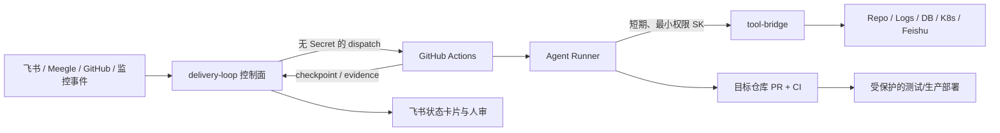

<!-- delivery-loop e2e validated -->
# delivery-loop

delivery-loop 是一个以飞书/Meegle 为任务入口、以 GitHub Actions 为弹性 Agent 运行环境、以 tool-bridge 提供受控上下文的端到端软件交付控制面。

它解决的不是“让 Agent 写一次代码”，而是把需求或缺陷从发现、澄清、授权、执行、验证、PR、评审、部署到审计做成可恢复、可证明完成的闭环。

## 当前状态

仓库处于 DOD 初始化阶段：规范文档、任务信封 v1、运行状态机、CI 和文档链接校验已经建立；飞书入口、持久化控制面、真实 Agent 执行和部署仍按 [DOD.md](DOD.md) 分 Phase 实现。任何尚未通过 DoD 的能力都不应被描述为“已支持”。

## 核心边界



- 控制面是真实状态、去重、审批、checkpoint 和审计的唯一持久化入口。
- GitHub Actions 是一次执行 attempt 的临时计算环境，不是状态数据库。
- tool-bridge 是按运行授权的上下文平面，不把全局管理员凭证交给 Agent。
- GitHub PR、required checks 与 Environment protection 是代码和部署闸门。

## 开始开发

```bash
pnpm install
pnpm run verify
```

执行顺序和证据格式见 [LOOP.md](LOOP.md)，产品边界见 [docs/Vision.md](docs/Vision.md)，模块与数据流见 [docs/Architecture.md](docs/Architecture.md)，接口契约见 [docs/Proto.md](docs/Proto.md)，安全基线见 [docs/Security.md](docs/Security.md)。

## 文档真源

| 文件 | 责任 |
|---|---|
| `docs/Vision.md` | 为什么做、User Cases、非目标与成功标准 |
| `docs/Architecture.md` | 模块边界、状态模型、存储和端到端时序 |
| `docs/Proto.md` | 事件、API、checkpoint、证据与错误契约 |
| `docs/Security.md` | 权限、Secret、prompt injection 与审批基线 |
| `docs/Reference.md` | 技术选型、平台事实和待验证假设 |
| `DOD.md` | 什么条件下算完成 |
| `LOOP.md` | 每一轮如何执行 |
| `PROGRESS.md` | 已完成证据、blocker 与下一步 |
