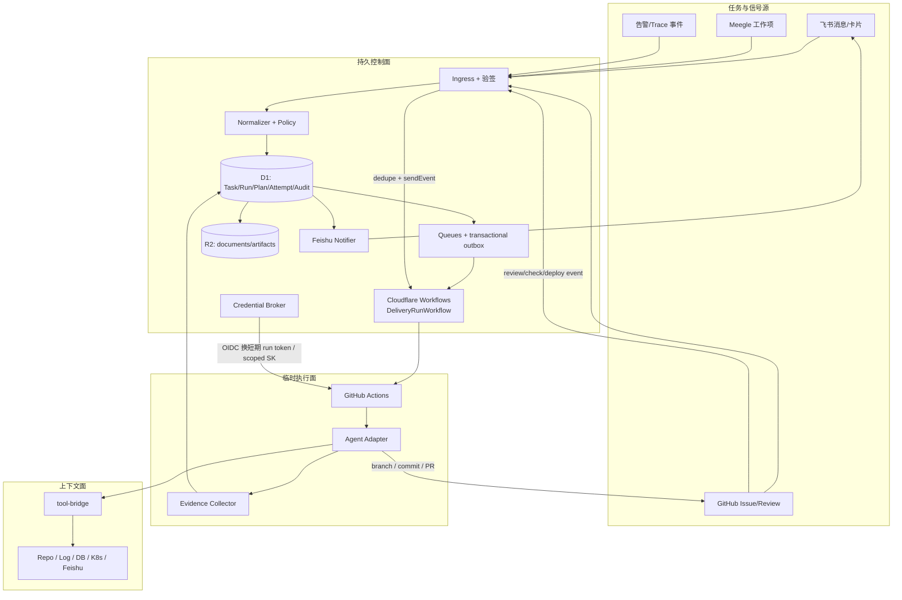
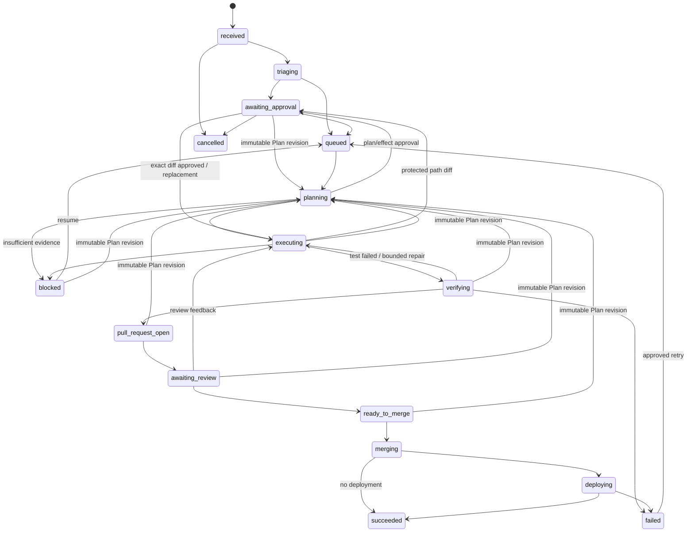

# Architecture

## 0. 结论与约束

方案可行，但必须接受五个平台事实：

1. 飞书 webhook 需要一个可公网访问且能验签、去重、快速响应的入口，不能直接“调用一个正在等待的 Action”。
2. GitHub-hosted Runner 的磁盘和进程是临时的，workflow 也有时长/并发/重跑边界，因此可恢复状态必须在 Runner 外持久化。
3. 用户反馈和 PRD 必须先经过只读分析，形成版本化 `ExecutionPlan`；任务级 DoD 不能只存在 Agent session、Action 日志或 PR 正文中。
4. Cloudflare Workflows 负责持久控制流和步骤缓存，D1 负责可查询的业务真相，R2 负责大对象；三者不能互相冒充。
5. `repository_dispatch` / `workflow_dispatch` 载荷不是 Secret 通道；tool-bridge 凭证必须在运行时通过 OIDC 或受控 broker 换取。

因此系统分为持久控制面、临时执行面、上下文面和事实系统四部分，并显式区分“Workflow 控制流恢复”和“Agent 工作区恢复”。

## 1. 总体拓扑



默认部署选择是 Hono Worker + Cloudflare Workflows + D1 + Queues/outbox + R2。Queues 负责削峰和可靠投递，不承担 Run 状态机；Cron 只用于 reconciliation/stuck scan。领域层不 import Cloudflare API，将来可以替换为 Temporal + Node/Postgres，但 Task/Run/ExecutionPlan/Attempt 契约保持不变。

## 2. 模块边界

### M1. Ingress Adapters

- 接收飞书 challenge/event、Meegle webhook、GitHub App webhook、监控告警和人工 API。
- manual Task intake不接受caller自报base SHA。完成认证、strict Task schema、Secret扫描和既有idempotency replay读取后，只有新请求才通过单仓库`contents:read` GitHub App token读取exact目标branch commit；成功SHA与Task/Run/workflow-create在同一intake边界固定。GitHub配置/allowlist/ref/响应不可用时在D1/R2前返回503；同key同request重放直接复用已冻结Run，不因GitHub短暂故障或branch后续前进改变base。
- operations-only GitHub base readiness探针复用manual intake的当前Worker resolver，在零D1/R2/Task/Workflow effect下预先穿透App私钥加载、installation token交换和exact branch ref读取。配置/reference使用固定unavailable/invalid阶段；凭证链只把签名、App auth拒绝、installation不存在、policy拒绝、收到HTTP响应前的transport失败、GitHub 5xx和响应非法公开为七个固定枚举，未知provider异常仍安全折叠为generic credential unavailable。installation-token POST本身固定10秒、`redirect=manual`、不跟随3xx且无自动重试；这是Cloudflare `workerd`支持的等价fail-closed实现，所有非201都在不读取body的前提下拒绝。transport catch与caller复用同一安全五分类，只把固定operation/failureKind/单次attempt写入唯一结构化日志sink，对外仍保持generic transport stage。成功SHA是时点事实而非Task snapshot，正式intake仍必须自行重读并在事务边界冻结，探针也不产生Task或production authority。
- 只先有界读取验签所需的exact raw bytes；在解密后的业务解析或任何持久化前完成平台验签、时间窗、tenant/app绑定和事件ID/nonce去重。
- 飞书加密入口直接复用Watt的signature/AES纯逻辑，但增加5分钟request timestamp、verification token、`FEISHU_APP_ID + FEISHU_DELIVERY_TENANT_KEY`双绑定。challenge验证后短路且零写入；event只落metadata receipt/nonce，raw/decrypted正文不会进入D1。
- 真实飞书入口验收保持三方事实分离：飞书后台`SUCCESS`必须人工核对，外部observability report只投影五类安全HTTP digest/status/latency，operations-only GET按exact tenant/event重读immutable receipt/ingress与Task/Run/effect计数。challenge继续零D1写入；manifest、Worker自报或单一HTTP状态都不能独自证明飞书已接受回调，详见[飞书 challenge、事件验签与拒绝零写入真实验收](FeishuWebhookE2E.md)。
- verified event receipt在同一D1 batch创建一个stable ingress outbox，scheduled fenced relay投递专用Cloudflare Queue；Queue message只有outbox ID且不是tenant/event/Task真源。consumer回查D1后只标记queue-observed，实际飞书/Meegle normalizer再把TaskEnvelope交给normalized sink。event ID防平台重放，Task source revision防不同event重复创建Run，两层identity不能合并。
- Meegle normalizer不直接传播raw work-item结构：adapter先完成全字段分页并投影strict snapshot，受信mapping profile再按metadata确认过的field/role key解析。普通field与role分离；owner进入`coordination.owner`，repository allowlist决定`target.owner/repo`，工作项字段没有policy/effect解释权。
- optional generic monitor adapter直接复用Watt exact-body HMAC和inclusive dedupe窗口语义。受信Worker配置固定tenant/repository allowlist/60秒～24小时窗口；服务端从rule/resource/repository/environment/severity派生fingerprint。event ID负责delivery幂等，fingerprint负责窗口内多event合并，两者不能由payload自报或互相替代。
- 规范化 Task 在写 D1/R2 前经过统一 Secret scanner；错误响应只接受 UUID correlation ID，不能反射任意外部 header。
- 3 秒内返回；耗时处理进入队列。
- 只做平台协议适配，不做 Agent 决策。

### M2. Normalizer + Policy Engine

- 把来源事件转换为 [Proto](Proto.md) 的 `TaskEnvelope v1`。
- Meegle字段齐全时复用normalized sink创建Task/Run；缺title/description/验收/owner/revision/目标仓库，owner歧义、repo越过allowlist或全量分页未完成时只创建metadata-only `triaging`候选，固定gap可由operations安全查询且Task/Run/effect均为零。
- Meegle的mapped与triaging两条分支都追加同一种immutable mapping lineage，绑定ingress/event、exact R2 snapshot、mapping profile和最终Task/Run或candidate。mapped分支先复用normalized sink；若Task/Run成功后Worker中断，重试会从既有source revision恢复并补lineage。operations evidence在服务端回读R2重算digest，不把R2 ref、正文、field value或principal发送给verifier。
- 仓库外Meegle verifier把live CLI metadata/完整分页、D1 mapping lineage和R2 digest回读作为三个层次：CLI证明当前tenant的field/role/work-item事实，D1证明事件到业务结果，R2证明normalizer实际使用的exact snapshot。分页未完成case保留原始snapshot布尔，而live重读必须无truncated/stopped/cursor；两者时间语义不能互相替代。
- 补充上下文继续走统一Task revision边界：飞书`new_run/apply_current`是两枚冻结按钮；Meegle不同event可各留mapping lineage并收敛到同一revision。operations evidence按context ID有界回读R2并关联Feishu action/Meegle mapping，默认模式不得改写source Run Attempt，显式apply才进入PlanRevision fencing；真实验收见[补充上下文 revision 与当前 Run 隔离真实验收](SupplementalContextE2E.md)。
- monitor firing event永远只进入独立candidate ledger：`MonitorAlertIngressStore`以同一个D1 atomic batch发布receipt、前进suppression head、聚合candidate并追加lineage，规范化正文仅写私有R2。不使用包含多语句body的SQLite trigger，因为Cloudflare D1的Wrangler远程migration路径不能可靠安装该形状；新库与历史库均由migration删除旧projection trigger。该路径不调用Task normalizer/Task intake，不创建Run/Workflow/outbox/approval，也没有policy/effect解释器；人工决定处理必须经过后续显式Task/审批边界。
- monitor生产证据不另建第二张真源表。Sentry native observer只负责原生exact-body验签、受控映射、generic重签和安全HTTP观测；D1 receipt/lineage/candidate仍是状态authority，私有R2是exact snapshot authority，Cloudflare settings和Sentry只读API分别是部署配置与当前project/rule authority。exact-event operations投影在服务端组合并重算这些本地事实，但不能用manifest或observer自报替代live platform事实。生产若明确不启用，则只走owner decision + live Cloudflare四binding全缺路径，不要求虚构Sentry事件。
- 缺授权但Task契约完整时进入`awaiting_approval`；缺执行契约字段时不得先伪造Task再补字段。
- 根据仓库策略计算允许的 tool-bridge scope、写权限、部署环境和审批要求。
- 策略由配置和人审决定，Agent 只能请求，不能修改。

### M3. Durable Orchestrator + ExecutionPlan

- 每个 Run 对应一个 `DeliveryRunWorkflow`，`run_id` 直接作为 Cloudflare Workflow instance id，避免额外映射表。
- Workflow 依次调度只读分析、计划校验/审批、DoD Item 执行、证据核对、PR/部署；等待外部结果使用 `waitForEvent`，长等待不占 GitHub Runner。
- 分析 attempt 产出不可静默修改的 `ExecutionPlan` 版本。每个 Item 声明目标、`doneWhen`、验证方式、依赖、effect 和 required 标记；执行状态单独投影到 D1。
- analysis Plan policy由可信Task投影决定而不是模型解释正文：当前试点中`requirement + allowRepositoryWrite=true`得到`requiresRepositoryChange=true`及`repo_write/test:unit/verify:all`提议上限，Runner与控制面使用同一派生函数复核；validator要求self-verifying required change，纯investigation不能进入active Plan。read-only requirement仍允许调查，bug不会仅因允许写就跳过诊断。analysis Action本身继续只有只读grant/sandbox；写入仍须active Plan、真人exact approval和独立execution credential。
- analysis Runner把digest-verified Task/Plan policy放进workspace内随机隐藏0700目录的0600 `context.json`完整性锚点，文件严格为`{schemaVersion:'1', contextDigest, context}`：Runner对嵌套context的JSON字节预先计算marker。调用provider前先限制完整envelope为256 KiB、扫描credential形状，并用全部runtime Secret扫描控制面context；通过后Adapter把exact envelope序列化成单个JSON对象，通过stdin的`BEGIN/END_UNTRUSTED_ANALYSIS_CONTEXT_JSON`区块作为明确不可信数据交给Codex，正文不进入argv、日志、artifact、checkpoint或D1。Adapter在模型调用前后都解析文件并重算嵌套context；requirement Agent必须把marker原样返回到strict `{contextDigest, plan}`，bug最终阶段同样返回strict `{schemaVersion, contextDigest, rootCause, plan}`。缺marker、marker与context不一致、模型缺失/猜错或额外字段在Plan validation、digest和持久化前拒绝，只有嵌套Plan可进入持久边界。bug logs/trace同样在有界扫描后只通过独立diagnostic stdin JSON区块进入第2/3阶段。Codex是否产生`command_execution`属于非确定遥测，不参与Plan接受决策。成功或失败都先删除context再做Git snapshot，因此绑定不会把临时文件变成仓库状态或持久Evidence；它只关联本次context envelope，不替代Plan语义、人审或后续Evidence验证。
- Plan Item scheduler从D1 active Plan拓扑派生ready集合：只把依赖全部passed的pending Item晋升ready。首次领取再次核对Run version、active Plan/version、progress version和依赖；repo-write还在SQL边界重验Task policy及exact approval expiry/reject/invalidation。self-verifying change Item的领取以稳定claim identity + D1唯一约束在同一个D1 batch创建Attempt、写`in_progress/activeAttemptId`和唯一`execution_dispatch` outbox；deploy Item不走该outbox。并发重放收敛，Agent不参与状态选择。
- required Item只能由服务认证的`PlanItemEvidenceVerifier`关闭：它把每条doneWhen映射到同run/attempt/plan version/item/head的passed Evidence，逐项覆盖声明的kind/command/external fact，并把decision、mapping、Evidence verified、Attempt完成/撤权和progress passed原子提交。通常要求active lease；若Runner已经退出导致lease过期，只在D1可信GitHub投影同时为`completed/success`且同head verification suite已completed时允许控制面恢复关门。稳定verification identity和evidence-set digest使重放收敛；Agent token、旧SHA、failed/skipped Evidence及直接progress UPDATE都不能关门。commit Evidence在绑定attempt head后保持不可变；migration 0063只放行控制面关门所需的一次`unverified → verified`，随后仍由verified-Evidence trigger完全冻结。
- 每分钟有界`ExecutionProgressReconciler`把批准后的happy path接成D1驱动的持久推进：exact repo-write approval令Run从`awaiting_approval`进入`executing`，领取首次implement；GitHub completed/success与completed suite共同成立后提交Evidence decision；全部required Item passed后CAS进入`verifying`，准备immutable Draft并调度唯一PR publication。Free plan的scheduled与Queue CPU上限只有10ms，因此Cron在recovery fence后必须先用原processor direct-drain最多5条Cloudflare Workflow effect，再relay剩余durable outbox并以最多5条运行execution progression，之后才执行stuck scan及其他外部inventory reconciliation；本轮新建的execution/PR outbox在下一分钟进入同一fenced relay。任何步骤失败只留在其可重试投影，不把扫描器本身变成状态真源。
- active Plan需要因review、补充上下文或base observation改变正文/base/effect时，控制面只消费预先落D1的immutable `plan_revision_source_facts`。`PlanRevisionStore`以Run/old Plan/source/base稳定identity把Run CAS回`planning`，只创建一个analysis Attempt/outbox，同时取消旧执行、撤销token/write credential、settle旧effect intent并为旧Plan全部approval写invalidation。新proposal仍走同一ExecutionPlan validator；只有严格next version且semantic body/base/effect至少一项变化才原子令旧Plan`superseded`、新Plan`active`并回`awaiting_approval`。GitHub review本地producer把签名feedback lineage、冻结Run version和Runner fencing转换为source fact；GitHub base producer用refs+compare外部事实把fast-forward observation/source/begin放入同一D1 batch，其bounded batch按分钟循环扫描候选，不能由不写状态的`unchanged`旧Run永久饿死较新Run；supplemental producer先写内容寻址私有R2，再把新Task revision/Run/context lineage与可选source/begin原子落D1。真实飞书/Meegle身份事件与Actions/Workflow外部证据仍未接通。
- base compare不是“尽量更新”：纯fast-forward才进入Plan revision；behind/diverged或异常merge-base进入immutable `github_base_conflicts`。`GitHubBaseConflictStore`以Run version CAS原子把Run/Plan置blocked，取消active Attempt、撤销token/write credential和旧approval、settle尚未执行的analysis/execution/PR intent并创建唯一Workflow cancel。`TaskQueryStore`只投影repo/branch/before/after/relationship和固定`manual_rebase`提示，不包含GitHub原始响应或Git输出。
- 自动rebase只在base-only Plan revision激活并重新批准后调度。scheduled reconciler要求semantic body/effects不变、旧Item已有verified Evidence decision、source Attempt/head/派生branch immutable、目标Item ready/dependencies passed、新Plan repo-write approval有效且source branch从未进入PR publication；满足时以stable identity原子创建`base_rebase_attempts + review_fix Attempt + execution_dispatch`并占用目标Item。20路扫描只产生一套业务记录；已发布PR branch保持零Attempt/effect。
- 固定workflow复用`review_fix`入口，但execution context要求verification repair、review feedback、base rebase三种lineage恰好一种。base path以新base作为OIDC/Plan/policy快照、旧verified bot head作为checkout，且不调用Agent。`BaseRebaseRunner`核对clean repo、source ref/head、旧base→新base ancestry及线性bot commit链后，用固定argv禁用hook/autostash执行rebase；它自身不push。成功callback只把新Attempt派生branchnon-force push并写source→rebased head CAS，之后重新执行targeted与全部required verify并把suite绑定lineage；内容冲突先`rebase --abort`，source ref不变、target回到source head且零Evidence，再由strict Runner endpoint原子blocked Run/Plan/Item、写revocation audit、撤权/失效新approval并创建Workflow cancel。若终态已提交但HTTP响应丢失，只有同一已撤销token与原version/generation可只读取回相同blocked投影，错误token或变更后的fencing仍拒绝。真实GitHub Actions外部证据仍是后续边界。
- 所有随机值、当前时间、数据库写、dispatch、通知和外部查询都放进稳定命名的持久步骤；步骤外只做纯控制流。
- D1 持有 Task、Run、Plan、Attempt 状态和乐观并发版本；Workflow engine 的 `running/waiting` 不能直接作为产品状态。
- `DeliveryRunWorkflow`在analysis Plan激活后不再提前`complete`，而是进入最长365天的`await-run-terminal` durable wait；`waiting`不占Workflow active concurrency。D1进入blocked/failed/succeeded/cancelled时不靠不可信event改业务状态，由scheduled reconciler通过fenced terminate intent结束平台实例。365天超时产生platform error后，同一reconciler按D1 active事实受控restart，因此长期会话不依赖单次实例终态或Worker内存。
- 普通hibernate/redeploy恢复与controlled replay分开取证。前者不调用restart API：真实analysis instance在`await-analysis-result`等待时发布唯一after Worker deployment，再由同一instance继续到active Plan与`await-run-terminal`；仓库外strict manifest只冻结安全标量。只读verifier同时核对D1 Run/Plan/唯一Attempt+dispatch、Cloudflare完整deployment选择与七条step时间线、GitHub stable-title Action inventory；before必须是wait开始时最后生效的deployment，wait期间只能有一个after，防止任意历史deployment被误配成恢复事实。D1 reconciliation必须保持一致且无restart/recreate repair，完整流程见[Workflow hibernate / Worker redeploy 真实验收](WorkflowHibernateE2E.md)。
- hibernate生产窗口采用migration-first的两次发布序列：先在显式account scope内应用当前profile migration并只读核对immutable row，再以同一main SHA与deterministic bundle发布before；Task进入wait且唯一dispatch已外部确认后，才发布唯一after。两次发布都使用`--strict`并分别授权；旧100% version只是人工review rollback anchor，不形成自动rollback authority。dry-run、healthz或配置文件都不能代替D1 profile、deployment traffic、Workflow step或GitHub Action真实事实。
- hibernate live-window coordinator不是新的业务状态机：它按30分钟exact authorization先验证仓库外Task、clean frozen source、双build和当前before，再调用既有Task intake；之后只组合现有D1 Plan/Case 8、GitHub stable-title Action、Cloudflare instance/deployment adapter和纯guard。等待只重试明确not-ready，任何identity/分页/Secret/状态冲突都停止。若首次operator已经唯一创建exact Task、但在Workflow/Action/after之前因外部配置失败而超时，新的fresh authority可显式设置`resumeExistingTask=true`；同一入口重新验证Task/source/before与五凭证，只接受Task已存在并把本次`taskCreateRequests`固定为0，Task缺失或普通authority误入resume都在deploy前拒绝。after上传首次build留在内存中的exact bundle，使用`--no-bundle --strict`且每个adapter实例只有一次deploy attempt；post-check也只读。长期状态仍完全留在D1/Workflow/GitHub三方真源，CLI summary和authorization文件都不是状态或完成证据。
- 每分钟Workflow reconciliation只读取`instance.status()`的枚举，丢弃error/output。watchdog完成re-arm后，Cron先用同一fenced processor直接drain Cloudflare Workflow outbox，再让Workflow reconciliation与通用Queue relay并发启动；直接drain与Queue consumer竞争同一D1 lease，最多一个执行effect。这样逐实例平台查询或Queue relay异常都不能永久阻塞控制流根节点；本轮reconciliation新建的repair outbox最迟由下一分钟处理。D1 active配platform complete/errored/terminated时写restart intent，active配unknown时写同ID recreate intent；但`runs.base_sha IS NULL`时这两条路径只记录scan并返回`base_sha_unresolved`，不创建repair。processor也在旧recreate/restart outbox真正调用平台前重读base，缺失则回pending且effect为零。D1 blocked/failed/succeeded/cancelled配platform queued/running/paused/waiting/waitingForPause时写terminate intent。状态一致只推进公平scan cursor并结案旧observation。controlled replay pending时自动restart让路；Run state/version变化使旧repair在effect前安全settle。
- 使用 transactional outbox 在“业务状态落库”和“创建 Workflow/派发 Action/发送飞书消息”之间保证最终一致，不用失败补偿删除伪造原子性。relay 只向 Queue 发布 outbox ID，Queue consumer 以 D1 lease token/fencing 执行副作用；Cron 负责补发遗漏 ID 和过期 lease reconciliation。
- 主Queue固定`max_retries=3`并把耗尽消息转入专用DLQ；DLQ consumer在ack前将原outbox身份和受控错误码投影为D1 `outbox_dead_letters(open)`。open记录会冻结relay、router和直接processor claim，避免平台已判死信后Cron又无限生产新消息；原outbox仍是唯一effect intent，DLQ不复制payload或权限。
- Workflow callback 先把 immutable signal identity/content 与 outbox 同事务写 D1；consumer claim 后重新绑定 Run、Attempt result projection 与 referenced Plan。有效结果才 `sendEvent`，cancel/timeout/stale result 以 terminal disposition settled 且无外部 effect；ambiguous send 重放先查 D1 是否已经应用。
- controlled replay 把 expected Run version、server-resolved stable step、active Plan snapshot、下游 effects、exact approvals 与既有 dispatch/PR/deploy reconciliation refs 原子写 D1，再以 `workflow_replay` outbox调用平台 restart。API 不直接碰 Workflow，任意 step name和客户端自报 effect均无效。
- 同一 `target_repo + task_id` 默认只允许一个写 attempt；只读分诊可配置并行。
- 每分钟watchdog按无进展时间区分四类状态：queued 5分钟、running Attempt heartbeat 90秒、awaiting_review 24小时、deploying 30分钟。阈值命中先写唯一durable incident与白名单结构化告警，再执行固定动作；状态/version前进后自动把incident结案，不能仅靠一次易丢日志表示已处理。

### M4. GitHub Dispatcher

真实试点的App installation、D1 dispatch和Action不能由任一单面自证。仓库外`GitHubAppDispatchEvidenceManifestV1`冻结App/installation/repository安全标量、权限/事件、selected inventory digest、Run/Plan/Attempt/outbox、workflow blob和Action/job ID；只读verifier用App JWT、未按repo二次narrowing的installation audit token及控制面用途隔离token实时交叉核对。workflow必须从Action immutable head读取，不能拿当前main或本地文件覆盖历史执行；stable-title inventory与jobs再证明只产生一个analysis Action且execution step未运行。由于GitHub token不暴露签发body，settings页和credential issuance审计仍是“installation只选一个repo”的独立authority，详见[GitHub App 单仓库安装与固定 dispatch 真实验收](GitHubAppDispatchE2E.md)。

真实analysis取证在该四方事实上增加Task/Plan/context/Runner四层，而不复制dispatcher验证器。`AnalysisActionEvidenceManifestV1`只记录安全分类、计数、SHA和digest；live verifier核对反馈/PRD映射、active Plan非空Evidence refs和Item结构、Case 8只读context/grant与零write credential，并从Action exact SHA读取固定Runner source-set。source-set聚合digest必须同时匹配manifest外受审release记录，避免manifest自行替换Runner与期望值。最终Action步骤同时核对HEAD仍为checkout SHA、detached HEAD和clean workspace；GitHub不提供瞬态本地branch历史，因此组织Runner审计仍是可选人工补强，详见[只读 Analysis Action 真实验收](AnalysisActionE2E.md)。

真实heartbeat取证继续嵌入并调用上述analysis verifier，再从D1安全查询读取append-only heartbeat receipt链、reference-only result和Attempt GitHub final projection，从Case 8读取signed webhook observation。receipt按Attempt version形成连续链，每段30～60秒且lease固定90秒；live GitHub API、webhook与D1 final `completed/success + updated_at`必须一致。manifest只冻结count/digest/time，不携token或raw payload，详见[Runner heartbeat 与 GitHub 最终状态真实验收](RunnerHeartbeatE2E.md)。

- 使用 GitHub App installation token 向目标仓库触发固定版本的 reusable workflow。
- dispatch 只携带 `run_id`、`attempt_id`、`plan_version`、`plan_item_id`、`task_digest`、`callback_url` 等非敏感引用。
- 目标仓库必须显式安装 App、包含受信 workflow 或在中央 runner 白名单中；不对任意仓库执行。
- GitHub dispatch 与 Cloudflare Workflow effect 共享同一 D1 fenced outbox 原语，不维护第二套 claim/settle/rollback 协议。processor 在外部 run ID 经 Actions API reconciliation 后才把 Attempt 置 `starting`、递增 version/generation 并签发启动 lease。
- 同一processor也消费`execution_dispatch`：首次`implement`必须不带repair/review/base-rebase source；`review_fix`必须在verification failure、head-bound review或base rebase三种lineage中恰好绑定一种。外部调用前重验active Run/Plan/Item。旧Plan、blocked/cancelled Run、来源数量错误或已换activeAttempt的延迟消息以安全terminal code settle且零GitHub effect；固定workflow已在本地按mode接入execution bootstrap，但没有真实试点Actions run时仍只构成可重跑契约，不冒充外部执行完成。
- scheduled relay 在 runtime 配置允许时把 Workflow/GitHub 两种 destination 的 ID 投到同一 Queue；Cloudflare Workflow destination另有每分钟一次的同processor fenced direct-drain fallback。Queue consumer回查D1 destination后路由对应processor，消息本身不能自选effect；direct drain与Queue重复命中由pending→delivering lease收敛。只有settled/missing/dead-letter-frozen ack，其余保留重试。管理员使用独立operations identity请求重放时，只把exact open dead letter置`replay_requested`并重新arm原outbox；下个relay或direct drain仍进入原destination processor，重新执行Run/Plan/approval和外部API reconciliation。
- 目标 workflow 用稳定 `run-name = delivery-loop/<attempt_id>`；dispatcher 先查已有 run，POST 204 后再查。API 暂不可见视为不确定失败并回 pending，重试通过 existing run 收敛，不能因 204/timeout 盲目重复 dispatch。
- `workflow_run` webhook 以 HMAC + delivery digest 验证外部 status/conclusion，绑定 run/repo/workflow/base/title/run attempt 后写 D1 观察投影；GitHub `updated_at` 负责乱序 fencing，独立 observation version 不干扰 Runner lease version。
- 每分钟 scheduled reconciliation 查询尚无 completed external fact 的 Attempt，用 repo-scoped GitHub App installation token读取 workflow run；API observation 与 webhook 共用 projector，稳定 fact digest 去重，用于修复 webhook 丢失而不是建立第二套状态机。
- 同一scheduled周期还扫描active pre-merge Run的base snapshot，但使用独立缓存、只有`contents:read`的单仓库token。adapter先读`GET .../git/ref/heads/<base>`，head变化后再读`GET .../compare/<old>...<new>`；只有`status=ahead + ahead_by>0 + behind_by=0 + base_commit/merge_base=old`才形成`base_update` source。unchanged不写账，behind/diverged留给冲突DoD处理，任一API/Run/Plan binding漂移都不能更新Run base。
- PR正文冻结后，控制面以独立`pull_request + github_api` outbox驱动Draft PR producer；stable publication identity绑定Run version、draft/body digest、Plan和final head。consumer复用同一Watt-derived outbox lease，但使用只有`pull_requests:write`的App token，先按same-repo head查询，再以当前唯一Worker Secret catalog重扫title/body，最后才决定是否POST；命中时以固定terminal code结算且GitHub effect为零。
- PR REST create/list响应只形成`created_unverified`候选。签名`pull_request opened` webhook是主外部事实，scheduled GET只修复漏失webhook；两者共用exact repository/base/head SHA/title/body digest/draft/open projector。只有该projector能写verified PR Evidence并CAS推进`pull_request_open`。
- 测试部署使用独立于Actions dispatch、PR和repo-write的第四类外部effect。scheduled reconciler只领取required delivery Item，要求`test_deploy`是唯一写类effect、无Plan command ref、声明deployment Evidence/external fact、依赖passed、最终head已有verified Item decision且latest exact approval有效；同一D1 batch写deploy Attempt、immutable `test_deployments` snapshot和`github_deployments` outbox。GitHub processor使用只含`deployments:write`的单仓库App token，创建响应只推进`created_unverified`，不会生成Evidence或推进Run。
- 固定test deployment workflow只接受GitHub Deployment的`environment=test + task=delivery-loop:test`，在`test` Environment中以exact deployment SHA运行；专用OIDC audience为`delivery-loop-test-deploy`，subject固定`repo:<repository>:environment:test`。控制面还逐项绑定repository、workflow ref、SHA和run ID，只保存JWT digest。Runner从该SHA读取strict delivery policy，核对控制面返回的`test:*` role ref后执行固定argv，并在子进程环境中移除GitHub deployment token和OIDC request token。
- `deployment_status`是测试部署结果的事实边界。HMAC projector绑定delivery digest、repository、GitHub deployment ID、delivery-loop deployment ID、SHA、task和environment，按GitHub `updated_at`单调推进并清洗HTTPS Environment URL。每分钟REST补偿使用独立于create的`deployments:read` token，先GET exact Deployment核对同一组binding，再读取最新status；API/webhook分别留reference-only observation但共用同一projector。只有已有OIDC attestation的success可创建独立deployment Evidence并由唯一Item verifier关门；failure创建failed Evidence、失败Attempt/Item但不把Run标成功。当前本地契约没有真实GitHub Environment、云role或URL事实，这些保持外部DoD未完成。
- 部署后验收不是deployment job中的尾部命令，而是下一条required verification Item。它必须直接依赖已`passed`且deployment Evidence已verified的test deployment Item，并且只声明一个`repo_read` effect、一个`acceptance:*` command ref、`test` Evidence和零external fact；20路scheduler以stable identity在同一D1 batch创建唯一Acceptance Attempt、immutable `test_acceptances` snapshot和第五类`github_acceptance` outbox。
- 固定acceptance workflow使用独立Actions token lifecycle、`run-name=delivery-loop/acceptance/<acceptance_id>`、test Environment、exact deployed SHA以及`contents:read + id-token:write`，没有deployment/write权限。专用OIDC audience为`delivery-loop-test-acceptance`；Runner从exact SHA的policy核对test target所声明的`acceptanceCommandRef`，仅把清洗后的测试URL放入`DELIVERY_TEST_BASE_URL`，并从命令环境移除OIDC request token、GitHub token、acceptance ID和控制面URL。
- Acceptance Runner result和GitHub workflow conclusion是两个独立事实。Runner result只保存digest/status/exit/duration并延长短lease；签名`workflow_run`或GitHub API补偿必须再核对repo/run/workflow/title/branch/SHA/run-attempt和GitHub `updated_at`。requested/in-progress绝不生成Evidence；success必须同时有Runner passed/exit 0，才创建`acceptance:*`绑定的test Evidence并由唯一Item verifier关门。workflow failure、Runner failure或两者冲突均fail-closed为failed Evidence/Attempt/Item，Run保持`executing`；当前没有真实Actions或测试URL事实，外部子项仍未完成。
- test rollback不是deployment/acceptance failure handler中的隐藏命令。scheduled reconciler只扫描签名平台事实生成的verified failed deployment/acceptance Evidence，再使用独立`contents:read` App token读取失败SHA上的`delivery.yaml`；policy缺失、非法、未声明对应`automaticOn` trigger或rollback role与deploy role相同，只写immutable负向contract observation并保持零Action/outbox。
- exact policy显式声明test rollback后，控制面原子创建独立deploy Attempt、`test_rollbacks` snapshot和`github_test_rollback` outbox。snapshot冻结source kind/ID/Evidence、原deployment/approval、Run/Plan、失败SHA、policy/contract digest、固定workflow、test Environment、`delivery-loop-test-rollback` audience与独立`test:*` role；20路读取/调度/Queue投递只产生一个workflow dispatch。
- 固定rollback workflow只拥有`contents:read + id-token:write`，使用test Environment、exact失败SHA和`run-name=delivery-loop/rollback/<rollback_id>`。Runner从exact SHA重新解析policy并核对trigger/role/policy/contract digest后才执行固定argv。Runner pass或workflow success任一单独都不生成Evidence；HMAC `workflow_run`与使用独立`actions:read` token的API补偿共用projector，双事实成功才写verified rollback Evidence并完成Attempt，失败/冲突写failed Evidence。原失败Item与Run不会被伪装为passed/succeeded。
- production target的strict policy schema没有自动rollback字段，production failure也不进入test rollback candidate查询。未来生产自动回滚必须新建production专属approval binding、Environment/OIDC/role/outbox和演练Evidence，不能复用本地test contract获得权限。
- 真实test rollback关门使用仓库外strict `TestRollbackEvidenceManifestV1`而不新增第二张汇总表。只读verifier对deployment/acceptance failure两条正向Run交叉Case 8 source/contract/rollback/OIDC/Runner/双源Evidence与live GitHub Action；对未声明contract和production failure两条负向Run，在Case 8零rollback projection/effect之外实时查询exact workflow+SHA+受控窗口的GitHub inventory为零。云审计/环境结果与production `not_approved`治理记录因平台接口不统一保留真人review，完整步骤见[Test rollback 真实外部证据验收](TestRollbackE2E.md)。
- Feishu状态通知不从Workflow history或Runner日志拼卡片。scheduled reconciler按tenant从D1 Task/Run/active Plan/Item progress、verified GitHub/Evidence、active blocker和exact trusted approvals生成完整v2 immutable presentation，同时保留PR/Merge/Test Deploy/Production Deploy四段。Action/check/PR/deploy只有可信external fact和安全HTTPS URL才展示；summary先限长/Secret scan/单行化，raw log、artifact/R2 ref与自由错误没有projection字段。20路扫描以digest和revision收敛为一个`feishu_cards` outbox，旧presentation在调用前settle；最早approval expiry写`refresh_after`，到期即使无D1新写也重投影并移除过期effect。首次POST持久化message ID，14天内PATCH同一共享卡片，超窗重建；token只在Watt-derived isolate cache与Authorization header中存在，飞书raw响应不落D1。token、create、PATCH与GET全部直接采用Watt固定10秒`AbortSignal.timeout`边界；429/230020/230049与timeout保留同一outbox为pending并保存固定分类码，presentation/latest/delivered revision均不回退。
- 人工修复不是operator重发card。operations先只读取得latest presentation/revision/digest，再以exact三元组创建immutable `feishu_delivery_card_refresh_requests`；API不接受message ID、card JSON、destination、effect或reason。request ID、下一presentation和outbox均稳定派生，20路相同请求只生成一套；新presentation只多一个不渲染的服务端refresh epoch，旧rejected delivery不删除。若HTTP在请求落库后中断，同一scheduled reconciler会消费pending request完成投影。
- 新presentation在同一D1 batch追加metadata-only lineage。它冻结prior presentation、`initial|source_change|approval_expiry|manual_refresh`、前后source watermark和refresh time；只有scheduled expiry且watermark未变时才允许`approval_expiry`。独立operations evidence view从strict stored v2重建安全snapshot并重算rendered digest，不暴露action nonce或raw JSON。真实verifier将D1 presentation/delivery/lineage、同message create→PATCH和live Message GET三方绑定，步骤见[飞书交付卡片展示与自然过期真实验收](FeishuCardPresentationE2E.md)。
- retryable Feishu failure 不再只依赖会被最终成功清空的 `outbox.last_error_code`：fenced processor 在自己成功把 delivering→pending 后，以 best-effort、幂等 callback 写 immutable `feishu_delivery_card_retry_observations`，只保存 outbox/presentation/attempt/fixed error/time。callback 失败不改变 retry 语义；operations view 以 Run 有界投影有序历史。真实验收再把该历史、refresh lineage 和飞书 Message GET 三方绑定，步骤见[飞书卡片限流/超时与人工刷新真实验收](FeishuRetryE2E.md)。
- 同一每分钟scheduled链还回读D1已知的active message ID。`GET /open-apis/im/v1/messages/:message_id?card_msg_content_type=user_card_content`只在内存解析原卡，adapter输出message/chat/sender app/timestamps与canonical card digest；reconciler必须同时匹配配置app/chat、exact active message和latest rendered card digest，才把丢失的PATCH响应收敛为immutable API observation、delivery与settled原outbox。message正文、上游`msg`和token均不持久化。首次POST若响应在message ID落库前丢失，GET没有安全发现键，只能在飞书一小时窗口内以同UUID重试；禁止按群历史模糊匹配后认领消息。
- 卡片operations view从D1 strict stored presentation重新hydrate并render，额外公开canonical rendered-card digest，但不公开presentation/card JSON。失败blocker真实验收器用用途隔离只读token同时读取Task安全projection、该operations view和飞书官方Message GET；只有Run blocked、路径label/人工prompt固定、latest与delivered/outbox完全收敛且live card digest和唯一Blocker段精确一致才通过。manifest只是仓库外安全索引，不能覆盖live事实；完整步骤见[失败 Blocker 飞书卡片真实验收](FailureBlockerCardE2E.md)。
- Phase 5真实试点使用仓库外`PilotEvidenceManifestV1`作索引而非事实真源。显式opt-in verifier以只读token同时回读三条D1 Run安全投影、五条GitHub Actions run和三个GitHub Deployment/latest status，核对repo/SHA/environment/task/approval/Evidence与success/failure分离；OIDC、reviewer、demo隔离和rollback结果因平台接口不统一，manifest只保存无query HTTPS审计链接并要求人工review。示例manifest或本地fake响应不能关闭外部DoD，完整步骤见[Phase 5真实试点验收](PilotE2E.md)。

### M5. Agent Runner + Adapter

- 固定 workflow 以 exact base SHA、`persist-credentials: false` 和只读 `GITHUB_TOKEN` 检出；Runner bootstrap 再核对 dispatch 的 run/attempt/task digest/base/mode 与控制面 context，分析 attempt 只读，执行 attempt 才能创建 `agent/<task>/<attempt>` 分支。
- Runner 在任何 setup/test/verify 前，用 commit-bound loader 从可信 `baseSha` 读取 `git show <sha>:delivery.yaml`，校验 strict `DeliveryPolicy v1` 并计算 canonical digest；不读取可变工作树中的 policy。Plan validator只接收由该 policy派生的 canonical refs，`DeliveryCommandRunner`只接收ref并复用共享的有界、`shell: false` command runtime，调用者没有argv/stdin/附加参数入口。
- `delivery.yaml` 分别声明 setup、targeted、required verify、可选post-deployment acceptance、protected paths和deployment contract。部署target只能引用同一policy中已声明的`verify:*`，test target还必须引用已声明的`acceptance:*`；policy/digest/base SHA后续与Plan、Attempt和Evidence绑定，但不会替代repo-write/deploy审批或GitHub Environment保护。
- test deployment Runner不会调用Agent，也不接受Task/Plan提供argv；部署命令只来自exact deployment SHA上的`deployment.test.command`。它先取得专用GitHub OIDC JWT并完成控制面attestation，再写`in_progress`，命令退出后只向当前GitHub deployment写`success/failure`；控制面仍须等待签名status，job启动或Runner stdout都不是成功事实。
- post-deployment acceptance Runner同样不调用Agent，也不接受Task/Plan提供argv；它只执行exact deployed SHA上由test target绑定的`acceptance:*`命令。它的HTTP result是待核对Runner事实，最终Item结果必须等待签名/API-reconciled workflow fact。
- test rollback Runner也不调用Agent；只在控制面已经核对exact-SHA contract与verified failure后执行`deployment.test.rollback.command`。它不接受Task、Agent、failure payload或Plan command ref提供argv，且移除GitHub/OIDC/控制面身份值后才启动子进程。
- Adapter 统一 `start/resume/interrupt/exportCheckpoint`，底层可接 Codex、Claude Code 或其他 Agent。
- Codex 的安全路径固定 `--ephemeral`，因此供应商原生 session 不作为恢复前提；resume 重新启动受限非交互进程，只引用 Runner 写入的 0600 context/checkpoint 文件，并在启动前核对 checkpoint canonical digest 与 plan/item/head binding。
- AgentSession 只接受 Runner-controlled、sequence 单调且 plan/item/branch 不变的进度快照；export 返回副本。interrupt 只作用于 adapter 自己创建的 session，幂等执行 TERM→有界 grace→KILL，reason 不进入 provider prompt/argv。
- 真实 Agent adapter 的验收结果使用仓库外 `AgentAdapterEvidenceManifestV1`：只记录 provider/CLI 版本、进程退出与 session 枚举、结构化输出 digest、checkpoint sequence/digest/Plan Item/head 和 ephemeral clean-worktree 标志。成功 manifest 必须由实际 `codex exec` 运行后生成，并由 strict verifier 重新绑定 checkpoint head 与最终 Git HEAD；schema example、fake executor、help 输出或 `codex login status` 都不能冒充已认证模型调用。
- Agent 仅能通过封装命令调用工具；每种 effect（read/write/deploy/destructive）由外部 policy gate 判断。
- analysis bootstrap把digest-verified context写入repo内随机命名的隐藏私有目录`.delivery-loop-analysis-context-*`（目录0700、文件0600）作为完整性锚点；有界且Secret扫描后的exact envelope通过`codex exec ... -` stdin的不可信JSON区块进入只读sandbox，不需要`--add-dir`。Agent output、动态proof-envelope schema和诊断中间文件仍只在repo外`RUNNER_TEMP`且为0600。Agent成功或失败后都先删除workspace context，再进行最终Git snapshot；每45秒heartbeat并原子替换内存fencing，停止heartbeat后才从已核对envelope提取content-only Plan，核对控制面identity/digest后complete。最终snapshot必须与启动值完全一致，finally同时清理两类临时目录。
- prompt injection按数据流而非关键词处理：stdin中的task/log/tool/code区块永远是untrusted reference，marker形状出现在正文时也只作为JSON string内容；Runner在provider前扫描context/diagnostic context，在出网前以全部runtime token历史扫描Agent Plan，控制面在D1 persistence前以Worker Secret/current token再扫。ExecutionPlan validator另强制required criterion覆盖和change→trusted verification依赖；因此模型服从恶意文本也只能产生被拒提议，不能获得写权限或跳过测试。
- Agent 子进程 stderr 在离开执行器前按敏感环境值和 credential 形状脱敏；共享command runtime在deadline触发时先冻结timeout事实，再执行TERM→1秒grace→KILL。即使子进程响应TERM后以0退出，结果仍为`timedOut=true + exitCode=124`，所有命令消费者都不能把超时当成功；analysis preflight再把该事实投影为固定`provider_timeout`。业务错误仅公开固定类别/exit code，不传播原始 stderr。
- 控制面所有生产日志只经过一个schema-aware结构化sink：递归redaction后再次Secret scan，字段只含白名单ID/枚举/计数/时间；Worker中除该sink外不允许直接`console.*`。所有Actions入口只输出固定Runner event/outcome/attempt ID的一行JSON，不接受Agent、Task、外部响应或错误正文。
- 每个步骤写 heartbeat、结构化 event 和 checkpoint；checkpoint producer 使用 active token + `checkpoint:write` scope 与 Attempt version/generation fencing，绑定当前 active plan/item/head 后把完整 canonical payload写私有 R2，再以 sequence CAS 发布 D1 安全投影。execution Codex JSONL另走`artifact:write`：Runner有界收集并按全部runtime credential扫描，控制面按统一Worker Secret catalog二次扫描，再以Watt-derived AES-256-GCM原语加密写专用私有R2；退出 trap 尽最大努力写终态，但控制面超时仍是最终兜底。
- terminal failure producer 只发送固定 code/site/path/human-input 枚举和 fencing，不发送 message/stack/fingerprint。控制面派生 retry scope 与 fingerprint；失败入账同时撤销 token，未达阈值只声明 retry allowed，不由 Runner 自建 replacement 或 dispatch。
- running detector以可信heartbeat阈值或lease expiry、Attempt status/version/generation与Run state/version双CAS发现失联Runner；同事务写`run_stuck_incidents`、置lost、Run blocked、撤销token并创建fenced Workflow termination intent。queued incident把过期delivering的`workflow_create`重置pending；该re-arm在下一分钟首先进入direct drain，随后Queue relay共享同一lease。awaiting_review只升级人工处理而不伪造拒绝/失败；deploying只要求既有签名webhook/API projector重新核对外部事实，不把超时直接当部署失败。人工cancel仍走相同generation/token撤销原语但把Run/Attempt置cancelled。
- recovery scheduler 等到旧 Workflow termination intent `settled` 后，才从当前 active plan/item 的最新有效 checkpoint 创建 pending replacement Attempt。稳定 identity 绑定 `lost attempt + checkpoint`，D1 以 `(recovered_from_attempt_id, recovery_checkpoint_id)` 唯一约束和 Run/Item CAS 收敛并发请求；replacement 未产出新 checkpoint 又失联时，可用新的 lost Attempt identity 复用同一最近有效 checkpoint。
- replacement 不继承旧 lease/token/GitHub run ID，也不自动得到 write dispatch。Runner 必须在 clean worktree 上用固定参数核对 checkpoint commit、detached checkout 并验证 HEAD，之后才启动新的 semantic-resume session；已 passed/skipped Item 不进入调度或 prompt。
- 真实恢复演练使用独立仓库外manifest和只读verifier，不复用Pilot deployment manifest。`GET /v1/runs/:runId/plan`公开Attempt `headBranch/headSha`及replacement `recovery={recoveredFromAttemptId,checkpointId}`安全投影；verifier再与correlation、两条Actions run/job、checkpoint/result commit、branch ref和GitHub compare交叉核对，要求result是checkpoint的fast-forward descendant，并拒绝lost之后重新调度已passed Item。该工具只验收已发生事实，不负责kill、retry或dispatch。
- Runner complete/failure envelope不包含Plan Item状态；Agent不能把Attempt结论转换为`passed/skipped`。required及investigation/verification的skip由D1 trigger拒绝，passed保留给独立Evidence verifier；因此Action重放、恶意Agent output或直接HTTP字段都不能解锁下游Item。
- approved write Runner通过固定`GitRepositoryWriter`执行Git mutation：普通实现与verification repair使用task/attempt派生的新branch；GitHub review repair只允许控制面lineage给出的同task namespace原PR branch。两者都逐步核对base SHA/clean tree/当前branch，Agent返回后、bot commit前要求HEAD仍为checkout base，bot commit后要求唯一parent仍为该base。review repair在建本地branch前以带临时token的`ls-remote`核对远端PR branch仍等于reviewed head，push仍是同ref non-force，远端随后并发前进由Git fast-forward规则拒绝。author+committer固定bot，token只进Git子进程env HTTP header，不进argv；宿主`GIT_*`被清理，repo hooks关闭。
- `commitAll`在bot commit之前统一stage并扫描内建+commit-bound policy protected paths；rename同时检查old/new path。命中时Runner只把base/tree/policy/diff digest与path/type/numstat安全摘要交给固定HTTPS reporter，writer固定抛`ProtectedPathApprovalRequired`，commit/push路径不可达；reporter失败也fail-closed。
- 控制面的`ProtectedPathApprovalStore`复用Attempt CAS、token revoke、credential revocation与transactional outbox：exact running repo_write上下文才可原子写gate/entries、Run=`awaiting_approval`、Attempt=`cancelled`/generation+1、Item gate ref和`workflow_pause`。consumer二次绑定D1后terminate Workflow；查询只投影安全entries，不读取raw diff。
- 验证Runner复用`DeliveryCommandRunner`与同一fixed Git executor：Plan选择至少一个policy `test:*`，Runner在其后强制追加policy全部`verify:*`，每条命令前后复核exact HEAD。任一targeted失败不进入required阶段，任一required失败停止后续；stderr/异常不进入上报body。
- `ControlPlaneVerificationEvidenceReporter`每次读取最新heartbeat fencing并调用strict suite/result API。D1 `VerificationEvidenceStore`把Plan Item声明的exact command集合规范化成有序suite，按first-pending CAS接受结果并生成head-bound unverified Evidence；Agent不能提交summary/status/verification status或跳过position。
- suite完成后Runner仍不能自行提交Item结论。控制面`POST /v1/runs/:runId/items/:itemId/verify`只接受版本/fencing/head和doneWhen→Evidence ID映射，不接受status/verified字段；`test:/verify:` Evidence还必须来自completed suite中的passed command。成功后D1 trigger只允许同一verification decision消费旧progress version并推进`passed`，查询投影公开安全decision/digest/mapping用于恢复和审计。
- verification suite失败后，failure event本身不授予重试。控制面从failed suite/command/Evidence派生content-safe fact digest，将implement/review_fix规范化到同一execution retry scope；未达阈值时原子创建同失败head起步的唯一review_fix Attempt、切换Item activeAttempt并写execution dispatch。连续第二个同command/phase/exit fingerprint直接blocked；不同fingerprint最多首次+两次repair。repair不继承旧token/credential或旧branch，repo_write仍重新核对原Plan effect/approval。
- 修复循环的仓库外证据使用 `RepairLoopEvidenceManifestV1`：必须同时包含一次成功修复、一次同 fingerprint 第二次阻断和一次三次 Attempt 上限阻断。verifier 复用 `GitHubActionsApiClient` 核对每个固定 workflow/run 的唯一 job、checkout/execution step；成功修复再核对 commit、branch ref 和 fast-forward compare。控制面 Plan/Case 8 audit 绑定 Attempt ordinal/mode、failure Evidence、blocker fingerprint/reason/attempt count 与 execution dispatch 数量，不能把重跑测试或 Agent 自报 failure 当作 repair 事实。
- `ExecutionAttemptRunner`把trusted setup→prepare branch→受限Agent edit→bot commit→no-force push→head report→targeted/required Evidence固定成单一路径；Agent输入必须显式指向repo外私有context/output，缺失时拒绝启动。Agent最终输出只能是strict`apply_fix/request_replan` decision；`request_replan`仅对exact GitHub review feedback lineage开放，Runner以当前token/version/generation调用固定reporter并在commit/push/verification前结束旧Attempt，verification repair或普通implement返回该decision会被拒绝。只有verification Runner返回的真实nonzero command结果可调用failure reporter，Agent、Git、protected-path、head或Evidence transport异常保持原始失败类别。
- 固定workflow现在按受信mode互斥启动analysis或execution脚本，checkout使用dispatch `checkout_sha`、完整fetch history且不保留凭证。execution bootstrap核对OIDC/dispatch/context/task digest/base/checkout/plan/item/repository，从Run `base_sha`读取commit-bound policy，从独立broker取得approval-bound写token，并以共享mutex串行heartbeat token rotation、head CAS与Evidence/failure请求；命令运行期间heartbeat可继续，reporter总使用最新version/token。
- D1 `ExecutionAttemptContextStore`只返回active executing/verifying Run上的exact implement/review_fix Item；首次implement尚无bot head时，context与dispatcher一致地把冻结`base_sha`作为`checkout_sha`，只有后续review_fix/recovery才要求已有source head。review_fix必须恰好关联immutable suite/Evidence failure fact或immutable GitHub review feedback lineage，source head都必须等于checkout head。review正文只从私有R2回读并核对metadata/schema/body digest，作为untrusted data返回；context同时给出受信`targetBranch/targetBranchMode`。Runner把Agent最终决策绑定到repo外临时0600 JSON Schema；Agent阶段在commit前失败时以active fencing提交固定failure，command runtime另以`stdoutInvalid`布尔区分bounded JSONL observer拒绝与普通进程非零，再只把版本控制内的failureKind枚举写入Action结构化结果；两条路径都不传播原始异常，也不伪造verification fact或repair。`ExecutionHeadStore`只允许每Attempt generation一次`checkout parent→受信branch bot head`，同事务写immutable transition、commit Evidence并递增Attempt version；20路同内容重放一条，branch/parent/head/Plan/Item漂移全部拒绝。真实GitHub Action和连续失败blocked外部证据未完成时，不得把本地bootstrap冒充完整repair Action。
- recovery与write Runner共用同一bounded `executeGitCommand`，固定`execFile + shell:false + timeout/maxBuffer + no terminal prompt`，不再维护第二套Git进程实现。write policy拒绝只给固定错误，Git stdout/stderr不穿透Agent或控制面。

### M6. Credential Broker + tool-bridge

- Action 使用 GitHub OIDC JWT 证明 `repository/workflow/ref/run_id` 身份。
- Broker 校验 attempt 仍 active、仓库与 workflow 匹配后，一次性签发用途隔离的短期 control-plane run token 与最小 scope tool-bridge PEP token；两者都绑定 Attempt generation/lease并只保存 digest。
- analysis与execution的run/tool grant都不含`repo:write`。implement/review_fix Runner只有在exact repo_write approval、Task policy、active Plan/Item与lease全部命中时，才能从独立broker取得单目标仓库、`contents:write + pull_requests:write`的GitHub App installation token。
- 写token authorization TTL取GitHub expiry、approval expiry和Attempt lease最小值。为跨Worker重启执行GitHub外部撤销，D1只保留digest与AES-GCM密文，密钥在Worker Secret；scheduled revoker按approval/Attempt状态claim，调用GitHub revoke后清除密文，失败进入可重试pending而不泄漏token。
- 初始 MVP 可使用仓库级只读 Secret，但不得支持生产写入；OIDC broker 完成后才开放跨仓库写/部署。
- Phase 3先由控制面的attempt-scoped PEP proxy接受`{toolPath, arguments}`：只认独立tool token，active status/generation/lease/revocation fencing后，从受信exact-path catalog派生action/effect，再通过service binding调Watt-compatible`/htbp/<path>`；run token、Agent自报scope/effect均无效，upstream internal/Admin Secret不出Worker。
- analysis grant由同一catalog生成五个安全action：repo/logs/trace/K8s read与database diagnostic。PEP只允许effect=`read`；已知repo/K8s write及database/shell destructive path即使scope投影被污染也在transport前拒绝，未知path不进入审计字段或upstream。未来改为Runner直连时仍须维持相同用途隔离、TTL、scope/effect双门禁、撤销和trace契约。
- tool-bridge 访问写 metadata-only 类别化 trace：run/attempt、工具路径、action/effect、duration、固定结果类别和时间。表结构没有 arguments、headers、response 或 error detail 字段；上游错误正文不读取，成功正文只返回当前 Runner且不持久化。
- bug analysis可在同一active Attempt内把一条成功`logs/search`和一条成功`traces/get`绑定成`diagnostic` Evidence。migration 0060只保存locator kinds/digest、root-cause/evidence digest与source trace ID；trigger和store重验same run/attempt、read effect与success，原始locator、日志、trace、数据库行、tool response和上游错误没有列。带`logs_read`的bug Plan在落库前必须至少引用一条该Attempt的verified diagnostic Evidence；operations查询以join重算Plan ref与source trace，不返回根因摘要。
- 固定analysis Runner现在把bug诊断限制为三阶段mediation：structured logs request → 固定`logs/search` → structured trace request → 固定`traces/get` → structured root cause/Plan。Runner向Adapter只暴露冻结的三函数capability facade，token、fencing和transport对象不在Agent可达对象图；heartbeat/tool调用共享进程内锁。tool result只在repo外0600临时文件存在，写入前做runtime Secret/credential shape与256 KiB扫描，finally删除。三次Codex调用各自预约/结算model usage；requirement/PRD仍是一次只读Plan调用。
- Runner在任何持久写前重验Agent不能自填`diagnostic_*` ref、Plan确实有`logs_read + diagnostic`调查Item、root cause安全且workspace snapshot未变化。随后以两轮arguments计算locator digest、用实际tool trace ID提交Evidence，回核控制面Evidence/root-cause digest，再把exact ref注入Plan并重算digest。因此Agent输出、tool result或临时文件都不是Evidence authority。

### M7. Evidence + Audit

- Evidence 是可验证结果：commit SHA、diff 摘要、测试命令及退出码、PR/check/deployment URL、审批记录。
- E2E-2组合验收不复制Analysis/GitHub parser：`BugTriageE2EEvidenceManifestV1`以canonical digest引用完整Analysis Action manifest，再live读取diagnostic安全投影和Case 8，交叉核对user-feedback bug、Run/Plan/Attempt/Action、logs→trace→root-cause Evidence、Plan ref及零credential/change/deployment。Analysis Action verifier同时从immutable SHA核对Runner固定mediation形状，`bug` manifest必须包含成功logs/repository/traces三类context；定位值和根因语义仍由仓库外Reviewer记录独立authority。完整步骤见[缺陷分诊真实外部证据验收](BugTriageE2E.md)。
- Audit 是不可覆盖的状态变化记录：actor、source event、from/to、reason、timestamp、payload digest。
- Phase 0 CI 外部验收不进入 D1 业务状态：仓库外 `CiEvidenceManifestV1` 只是四条真实 Actions run 的安全索引，生产 `GitHubActionsApiClient` 与 Contents/jobs/logs API 才是 live fact。workflow blob 必须按 run 的不可变 head SHA 读取；main/PR branch、本地文件或 manifest 都不能覆盖实际执行版本。合法/非法 Task 的差异由命名 validation step 的成功/失败证明，invalid Task 的受控 canary 只在 verifier 内存扫描，manifest 仅保存 digest。
- Phase 0 repository bootstrap 同样不进入 D1：用户决策记录是 owner/name/visibility/default branch/protection policy 的 authority，仓库外 manifest 只保存 decision/principal/selection digest。只读 verifier 同时核对固定 Git argv 读取的本地 `origin`、GitHub repository/default branch 和 active rules；这三层任一缺失都不能把本地初始化解释成远端已完成。
- redactor 是日志/响应安全输出边界；scanner 是 Task/checkpoint/artifact/PR 持久化或发布前的 fail-closed gate。Worker credential由`configuredSecrets`单一catalog派生，新增配置不能靠各producer手写列表。scanner finding只记录`path + kind`，不记录命中内容；结构化日志在redaction后再扫，PR在真正GitHub effect前再扫，artifact在Runner与控制面两层扫描。
- required Item全部由verified Evidence关门后，PR正文先由控制面从exact Task revision、active Plan、最新bot head和final-head test ledger确定性生成，再连同body digest与验收/Evidence/未完成Item子快照写入D1。该`prepared`快照是可恢复的GitHub PR producer输入，不是PR外部事实；Workflow/Queue重放必须复用同一快照并在effect前reconcile GitHub。
- PR publication把prepared snapshot与exact repo-write approval冻结为immutable effect intent；GitHub create response不能写Evidence。signed webhook/API projector把外部fact digest、PR number/净化URL与head绑定后，才生成固定summary的verified `pull_request` Evidence并推进Run。
- `run_id`是交付链correlation root。Task、Attempt、tool trace、GitHub run、PR和deployment继续由各自authoritative ledger持有身份，D1只读correlation views按kind/scope把它们投影回唯一Run；不复制事实、不用trigger写放大，也不把单次HTTP `x-correlation-id`误作长期根。
- 模型计量直接复用Watt“一次真实模型调用一行append-only usage”的结构：每行绑定run/attempt/tenant/repository/user、provider/model、input/cached/output/reasoning token、整数micro-USD和source digest。Codex JSONL只在Runner进程内逐行投影官方`turn.completed.usage`四个计费数字；锁定的Codex 0.145.0还会发送`cache_write_input_tokens`，Runner只校验其为非负整数后丢弃。thread ID、Agent消息、reasoning、命令/tool内容和原始stdout立即丢弃，不进入D1、日志或artifact。
- 原始 Agent session/transcript只能以`AES-256-GCM`ciphertext写专用私有`RAW_AGENT_OBJECTS`，并在D1显式登记固定30天policy。当前execution Codex `--ephemeral --json` adapter把同一有界JSONL同时喂usage与transcript collector；stable UUID、Attempt version/generation/token、active Plan/Item及`artifact:write`共同fence上传，recoverable intent完成后registry才可见。analysis/session原始对象尚无producer，不得把checkpoint或Task正文误登记为raw。
- 每分钟retention scanner只从`raw_agent_artifacts`按公平cursor领取到期对象，key由服务端用category+UUID推导；不列举或接受bucket/key/prefix。R2删除并再次`head`确认不存在后才写完成审计，网络或metadata不确定只写固定失败类别并释放为可重试。
- Secret safety 的仓库外证据只索引安全事实，不把 canary、日志、PRD、PR 正文或 ciphertext 带出仓库：`SecretSafetyEvidenceManifestV1` 必须同时包含 `safe_draft_pr` 与 `blocked_secret_publication`。verifier 从显式 opt-in 环境变量把 canary 仅放入内存，使用既有 `GitHubActionsApiClient` 核对固定 workflow/run，再以有界 jobs/logs API 扫描每个 job；拒绝分页、HTTPS 以外的日志重定向、单 job 8 MiB 或单 Run 32 MiB 超限。安全 case 还核对同仓库/open/draft/head/base/body digest 的 GitHub PR；blocked case 必须 API 查询同 head/base 的 PR 列表为空，并与 Case 8 的 settled `pull_request_secret_detected` zero-effect 投影一致。
- 结构化checkpoint、Evidence、Task/review/context及backup对象不在raw registry和专用bucket中；retention永不对这些表/bucket执行delete。raw bucket也不进入D1/R2备份集合，避免短期敏感正文被长期备份放大。
- [OperationsRunbook](OperationsRunbook.md)把GitHub、飞书、tool-bridge、D1、Secret泄漏和错误production deployment六类事故固定为触发→只读诊断→止损授权→恢复→外部验证→证据/结案。命令目录只引用现有strict API；provider pause、导入前traffic isolation和production rollback明确保留为双人批准的外部平台动作，不从文档文字获得控制面authority。
- Cloudflare Workflow 的输入、事件和 step result 只保存 ID、digest 与脱敏摘要；原始 PRD、用户反馈、日志和数据库结果进入 R2/受控来源并以引用关联。

### M8. Feishu Experience

- 一个任务对应一张持续更新的卡片，显示Run/Task/Plan快照、DoD进度、本轮目标、安全checkpoint/Evidence摘要、可信外部链接、blocker和有效approved effects；v1在途presentation可继续发布，latest只生成v2。
- 卡片动作只发Watt-compatible `id + signal`意图。signal由immutable presentation冻结card/presentation/task/run/Plan/base/action/effect/application nonce，不携带principal、policy或caller-selected retry/replay target；服务端只在飞书验签、exact app/tenant/chat/message/latest presentation与当前D1快照全部一致后，实时用`open_id`解析human/role并claim一次性nonce。隐藏按钮、旧卡和合法飞书签名都不能单独授权。
- card action与普通消息入口分流：前者只有metadata webhook receipt、action receipt和terminal outcome，不创建Task ingress outbox。授权后仍调用既有approval、Run lifecycle、recovery、Workflow replay和supplemental-context store；retry Item与replay step由服务端从当前状态推导，控制面不建立第二套动作状态机。失败outcome进入下一张presentation的action epoch，产生新nonce而不重放失败的业务effect。
- verified card action在decode/chat/action policy前先落metadata delivery，使篡改、转发、旧snapshot、错误群和撤权点击也能以exact event证明“收到但零effect”。operations action evidence只把receipt/outcome与event-bound approval/outbox/Attempt+checkpoint/replay/context lineage连接；独立HTTP observer和人工scope/membership/open_id mapping仍是另外两种authority，任一单独来源都不能关闭真实tenant DoD。
- 评论和补充材料创建新 revision；默认产生独立queued Run，不会静默修改正在执行 attempt 的prompt。只有显式、版本绑定的apply-current才把新revision Run记为`cancelled/absorbed`并对旧Run启动Plan revision，避免两条执行链重复交付。

### M9. Merge + Deployment Gates

- 合并必须依赖目标仓库分支保护和 required checks。
- merge gate 的 Case 8 projection 是只读审计索引：observation、normalized required checks、evaluation 和可选 decision 必须在 D1 join 后以 canonical fact digest 重算；projection 缺行、孤儿 check、count/digest drift 或 partial decision 都 fail-closed。
- `MergeGateEvidenceManifestV1`/`e2e:merge-gate` 是仓库外的真实事实门禁，直接复用生产 GitHub merge-gate adapter 和 Watt 的 opt-in、64 KiB manifest、0/1/2 退出模式。ready 与 rejected 结果均要求 merge outbox/merge ledger 为零；manifest 不得成为状态真源。
- scheduled merge gate使用用途隔离的只读GitHub token，按verified publication读取exact PR、base ref、active branch rules、latest check-runs/commit statuses和当前head reviews；adapter只输出SHA、状态、计数与canonical digests，不保存REST body。`github_merge_gate_observations`与normalized required checks冻结外部事实，`merge_gate_evaluations`冻结D1 Run/Plan/approval判断；只有required policy存在、全部required checks passed、review规则满足、PR非Draft且可合并、PR/base/head仍为当前快照、required Item全部passed、Plan声明merge effect且latest exact approval有效时，stable decision才CAS把Run推进`ready_to_merge`。
- 高风险审批身份层直接复用Watt的`identity_mappings`、`channel_identities`和`IdentityMapper`：外部适配器分别以`github:<repository> + login`、`feishu:<tenant> + open_id`解析principal，roles每次从D1实时读取。独立approval-adapter服务凭证只证明调用方是已验签adapter，不能替代人的身份；请求不接受actor、task/Plan digest或base，控制面从active Run/Plan与最新PR作者观察派生这些绑定。只有human且具`approve:merge|approve:production_deploy`角色、并与PR作者及Agent principal分离的decision可进入可信审批视图。
- `repo_write`的无飞书试点恢复通道使用GitHub base commit comment，而不是让operations调用方自报人。模板由D1 active Task/Run/Plan/base派生；真人在exact base commit留下未编辑的snapshot comment后，控制面用现有App `contents:read` credential回读并要求`OWNER`、comment ID/body/SHA/time/URL全绑定。operations请求只有comment ID，观察成功后才在D1映射`github:<repository> + login`到一小时有效的`human + approve:repo_write`decision，并复用统一source/identity/lineage表；Task/Operations token、comment正文或manifest本身都不能产生approval。
- Case 8 `identityApprovals` 同时索引 accepted binding 与 rejected self-approval；rejected source 也冻结安全的 principal/channel/roles digest snapshot，避免“没有 approval 行”被误读为没有尝试。`IdentityApprovalEvidenceManifestV1`/`e2e:identity-approval` 直接复用生产 GitHub adapter 与 Watt E2E 门禁原语，Feishu signed identity 的真实外部边界保持独立。
- 跨平台approval pair不新增第二张真源表：`ApprovalLineageEvidenceManifestV1`/`e2e:approval-lineage`只读组合既有Case 8、Feishu card-action operations、独立signed observer和生产GitHub PR/review adapter。它要求Feishu/GitHub两个event各自拥有独立source/approval/lineage，但解析到同一human且冻结相同Task/Run/Plan/base/effect；same-event replay、distinct-event nonce隔离、same-event snapshot conflict和zero merge effect缺一不可。open_id↔GitHub login↔principal仍由受管目录人工review，不让manifest成为identity authority。步骤见[飞书/GitHub审批唯一关联真实验收](ApprovalLineageE2E.md)。
- Test deployment 外部事实继续分层：`test_deployments` snapshot、OIDC attestation、Deployment create、signed/API status observation、独立 Evidence 与 Environment URL 不是同一事实。Case 8 只投影 test workflow/OIDC 标量和 `checks.testDeploymentObservations`；`TestDeploymentEvidenceManifestV1`/`e2e:test-deployment` 复用 Watt 固定提交的显式 opt-in、64 KiB manifest、0/1/2 退出和有界 HTTP，并复用现有 test-deployment status adapter 与 Actions parser。OIDC/生产 Secret 隔离审计链接只供人工核对，不能由 manifest 或 Runner 自报升级为成功。
- Test acceptance 继续与 deployment 分层：Deployment success 只允许调度 acceptance，不创建 test Evidence；Case 8 `checks.testAcceptances` / `testAcceptanceObservations` 同时索引 acceptance snapshot、OIDC attestation、Runner result、signed/API workflow fact 与最终 Evidence。`TestAcceptanceEvidenceManifestV1`/`e2e:test-acceptance` 固定 running/passed/failed 三种不同 Run，复用现有 `GitHubActionsApiClient.getAcceptanceWorkflowRun()` 与 Watt E2E 门禁原语；Action completed/success 仍必须和 Runner exit 0 一起成立，失败或冲突只进入 `executing|blocked`，不能把 acceptance 自报当成成功。
- `approval_source_events`冻结外部event digest/subject且不存payload；`identity_bound_approvals`冻结approver/author两侧渠道映射和分离结论。可信视图还会在effect消费时重新JOIN当前渠道映射和live roles，因此撤销role或改映射会立即关闭merge/replay，而不改写历史审批。裸`approvals`行不是merge/production authority。
- eligibility不是merge effect：`merge_gate_decisions`不创建outbox、不调用GitHub merge API。当前MVP由真人/受保护GitHub机制合并；若未来拍板自动merge，producer必须重新消费该decision和当前Run version，并有自己的stable idempotency/reconciliation。任何rejected evaluation只提供安全reason/counts/digests，不能作为“已尝试合并”证据。
- 当前MVP不执行自动merge mutation：真人或受保护GitHub机制完成merge后，HMAC签名`pull_request closed + merged=true`才是主事实；scheduled补偿复用既有只读merge-observation token读取exact PR，不申请merge写权限。两条来源进入同一projector，重新绑定ready decision、verified publication、repo/PR、head branch/SHA、base branch、PR URL和active Plan；closed-but-unmerged、gate前事实或任一漂移只记录ignored observation，不能创建merge账本。
- exact merge事实以stable identity创建唯一immutable `github_merges`和verified pull-request Evidence，保存GitHub merge SHA、merged actor/time及deployment disposition，不保存raw webhook/REST或token。Run用两个受控CAS边从`ready_to_merge`进入`merging`，再依据可信Task/Plan policy裁决：no-deploy直接进入`succeeded`；test target的deployment与post-deployment acceptance本就是merge gate前必须passed的required Item，因此merge也进入`succeeded`；只有production target进入`deploying`等待merge-SHA-bound approval与后续deployment fact。merge fact不能替代production事实，也不能绕过test required Item。
- production approval是post-merge release ledger，不伪装成合并前已passed的Plan Item。`IdentityBoundApprovalStore`只在Run=`deploying`且`github_merges.run_version + 2 = Run.version`时接受production decision；task revision、active Plan/digest、merge ID/SHA与`environment=production`都由服务端派生并写入immutable `production_release_approval_bindings`。`trusted_effect_approvals`对production必须同时join该binding、immutable merge和live identity/role/separation；裸approval或caller自报SHA/environment没有authority。
- production scheduler只扫描production disposition的merged Run；exact approval存在后，同一D1 batch创建唯一deploy Attempt、`production_deployments` snapshot与`github_production_deployments` outbox。effect前再次核对Run/Plan/revision/merge/approval/live role，随后用独立于test的deployment token cache创建`environment=production + task=delivery-loop:production + ref=merge SHA`的GitHub Deployment。create只推进`created_unverified`，不生成Evidence、不退出`deploying`；最终状态由独立platform status projector裁决。
- 固定production workflow绑定GitHub `production` Environment，因此真实仓库配置required reviewers时job在执行任何部署步骤前由GitHub保护；本地契约不能证明该外部配置存在。workflow只拥有`contents:read + deployments:write + id-token:write`，checkout exact deployment/merge SHA，并使用独立production OIDC audience、Environment subject和`production:*` role。Runner从该merge SHA读取strict policy，只执行production target固定argv，并移除GitHub/OIDC/production/test控制值；控制面只保存OIDC digest。
- production final status以HMAC `deployment_status`为主、scheduled REST补偿为辅。REST使用独立于create的`deployments:read` token，先GET exact Deployment核对ID/SHA/task/environment/reference-only payload，再GET statuses并只取真正最新一条；latest queued/pending/inactive不会借旧success推进。两条来源进入统一`production_deployment_status_observations`，只保存fact/payload digest和白名单标量，按GitHub `updated_at`单调前进。
- production status 外部证据 verifier 以仓库外 strict manifest 索引四类 platform state，并从 Case 8、GitHub Deployment/latest status、Deployment-triggered Action 和双源 observation 重算事实；Action 的 `success` 输出只作对照，不是状态入口。manifest 不保存 raw payload/token/OIDC，真实 Environment/云审计链接只作人工索引。
- `in_progress`、OIDC attestation和Runner status POST都不能生成Evidence或推进Run。只有exact production status success且已有OIDC attestation，才能原子写verified deployment Evidence、完成deploy Attempt、把active Plan置completed并CAS `deploying → succeeded`；failure/error不要求把失败伪装成已attest，直接写verified failed Evidence、失败Attempt并CAS `deploying → failed`。终态冻结，晚到success不能复活failed Run，双源/20路重放依靠stable observation/Evidence identity收敛。
- 测试部署、合并、生产部署是三个单独的状态/证据面。
- 生产环境使用 GitHub Environment reviewer 或外部审批，部署身份通过 OIDC 获取云权限。
- 部署失败默认保留 PR/commit 和诊断证据；测试自动回滚只调用失败SHA上明确定义、可重跑且声明对应trigger的rollback contract。生产自动回滚不复用该路径，必须另有审批与演练证据。

## 3. 核心状态模型



Run 是业务闭环，也是一个 Cloudflare Workflow instance；ExecutionPlan 是 Run 下的版本化任务级 DoD；Attempt 是一次 GitHub Action 执行。一次 Run 可有多个 Plan 版本和 Attempt，但同一时刻最多一个具有仓库写租约。`failed` 可重试，不是不可恢复终态；`succeeded` 和 `cancelled` 才是不可继续的业务终态。

```text
Task Revision
└── Run / DeliveryRunWorkflow
    ├── Analysis Attempt(s)
    ├── ExecutionPlan v1..n
    │   ├── DoD Item definition
    │   └── DoD Item progress + Evidence refs
    ├── Implementation/Review/Deploy Attempt(s)
    └── External facts: PR/check/deployment
```

## 4. 持久化模型

| 表 | 关键字段 | 不变量 |
|---|---|---|
| `tasks` | source、task_key、revision、normalized body、target repo | `(source, tenant, task_key, revision)` 唯一 |
| `runs` | task_id、workflow_instance_id、state、policy snapshot、version、active_plan | `workflow_instance_id = run_id`；状态更新使用 compare-and-set |
| `execution_plans` | run_id、plan_version、task_revision、base SHA、digest、status、creator attempt | 同一 Run 的版本单调递增；计划内容发布后不可原地修改 |
| `plan_items` | plan、item_id、definition、dependencies、effects、required | 同 plan 内 ID 唯一、依赖无环、至少一条 doneWhen 和 Evidence 要求 |
| `plan_item_progress` | plan item、status、active attempt、version | required item 只有exact verification decision存在后才能 `passed`；状态更新 CAS |
| `attempts` | run/plan item、GitHub run/status/conclusion/external updated time、base/head SHA、recovered-from attempt/checkpoint、version、lease generation/token digest/expiry、heartbeat、result | 状态与 heartbeat 使用 CAS；同一 run 单 active write lease；replacement 以 `(lost attempt, checkpoint)` fencing；明文 token 不落库；GitHub observation version 与 Runner fencing version 分离 |
| `attempt_heartbeat_receipts` | run/attempt、lease generation、前后Attempt version、前后heartbeat、lease expiry | 每次成功heartbeat同batch append；`(attempt, version)`唯一且UPDATE被trigger拒绝；无token/token digest字段 |
| `github_webhook_deliveries` | delivery ID、raw digest、repo/run、applied/ignored、时间 | 不保存原始 payload；同 delivery 换 payload冲突，乱序事实不回退 Attempt 投影 |
| `feishu_webhook_nonces` / `feishu_webhook_deliveries` | tenant、nonce/event ID、app/event type、request/event digest、verification mode和时间 | 验签/解密/时效/tenant/app全部通过后才写；nonce与event双重唯一、所有行immutable；不含raw/decrypted payload、verification token、encrypt key或外部错误；challenge零写入 |
| `feishu_ingress_outbox` | verified delivery/event/tenant/digest、relay state/lease/attempt、Queue observation、normalized Task/Run/ref/digest | 每event一个stable outbox；pending→delivering→enqueued→queued→settled，确定send失败回pending，DLQ终态留痕；Task sink只接受queue-observed exact event/tenant。不同event可settle到同一Task/Run revision；Queue重复消息不产生第二outbox或业务执行 |
| `feishu_ingress_queue_observations` | ingress outbox、固定Queue名、message ID digest、delivery attempt、message/observed time | metadata-only且UPDATE被trigger拒绝；`(queue,message digest,attempt)`唯一，相同attempt幂等、后续attempt追加；consumer observation与queued投影同batch，原始message ID/body无列 |
| `monitor_alert_receipts` / `monitor_alert_suppression_heads` / `monitor_alert_candidates` / `monitor_alert_lineage` | verified event/snapshot/profile/fingerprint digest、safe repository/rule/resource digest/severity、current suppression window、triage occurrence与event lineage | receipt/lineage immutable；同event只计一次，窗口边界inclusive，head只允许同candidate计数前进或过窗切新candidate；candidate冻结identity只允许计数/lastSeen单调更新。无Task/Run/policy/effect/approval/outbox字段，raw body/title/description/resource只在Secret-scanned私有R2 |
| `github_api_observations` | 稳定 observation ID、canonical fact digest、repo/run、applied/ignored、时间 | 不保存 REST body/token；同 fact 重轮询收敛，复用 webhook 的全绑定 projector |
| `attempt_revocations` | run/attempt、reason、撤销 lease generation、Attempt version、时间 | complete/cancel/timeout 的 reference-only token 撤销证据；不保存 token/digest 原文 |
| `attempt_tokens` | attempt、OIDC/run-token/tool-token digest、lease generation、scope、共同 expiry/revocation | 同一 attempt generation 一次交换；两个 opaque token用途隔离且digest不同；TTL不超过lease；明文不落库 |
| `checkpoints` | attempt_id、sequence、plan/version/item、summary、next step、head SHA、R2 ref/digest | sequence 单调递增；同序不可变；完整 payload 在 R2；只恢复当前 active plan 且回读时复验 metadata/schema/canonical digest |
| `workflow_signals` | run/event、Attempt、sequence、payload ref/digest、event type/time | `(run,event)` 与 `(run,sequence)` 唯一；同 identity 的完整内容不可变；正文不进入 signal |
| `evidence` | kind、command、exit code、URL、artifact digest | append-only，不把日志文本等同成功 |
| `approvals` | task/plan revision、plan digest、base SHA、effect、actor、nonce、decision、expires_at | 批准只作用于精确计划与 effect；旧 plan/nonce 不可重放 |
| `identity_mappings` / `channel_identities` | principal→live roles；channel+external subject→principal | 直接复用Watt身份解析面；GitHub/飞书渠道隔离，未映射为anonymous；角色和渠道映射在effect时重验 |
| `approval_source_events` / `identity_bound_approvals` / `approval_identity_rejections` | provider/tenant/event digest、外部subject、approval、approver/PR author principal、roles digest、分离结论或固定拒绝reason | source与outcome immutable且一对一；不接受caller actor；`trusted_effect_approvals`只暴露当前仍具human/effect role的GitHub comment repo-write及具分离结论的merge/production decision |
| `approval_lineages` | approval/source/card receipt、provider/tenant/external event/digest、approver/roles digest、Run/Task/revision、Plan/version/digest、base/effect/decision、source与control-plane时间 | 每个external decision恰好一条immutable关联；approval与provider事件双唯一，insert trigger重验exact approval/source/receipt shape；不含raw payload、request、token、nonce或display name，不替代`trusted_effect_approvals`权限视图 |
| `plan_revision_source_facts` | run/expected Run version/旧Plan、source kind/ref/digest、requested base、时间 | review/context/base adapter核对后才可写；snapshot不可UPDATE；调用方ref/digest不是事实 |
| `plan_revisions` | expected Run/旧Plan/base、source fact、新base、analysis Attempt、新Plan与change flags、状态 | 相同source稳定收敛；analyzing→activated；旧Plan正文不复制也不改写 |
| `approval_invalidations` / `base_conflict_approval_invalidations` / `base_rebase_approval_invalidations` | approval、对应revision/conflict/rebase、固定reason/time | 三个append-only ledger由`invalidated_approvals`统一读取；所有credential/PR/review/replay消费者都必须排除 |
| `github_base_observations` | run/expected version/旧Plan、repo/base branch、before/after SHA、ahead count、ref/compare/source digests、时间 | 只保存GitHub API规范化fast-forward事实；snapshot不可UPDATE；与source fact/begin同batch，raw响应/token不落库 |
| `github_base_conflicts` | run/version/旧Plan、repo/branch、before/after/merge-base/count/digests、固定人工输入 | non-fast-forward只生成immutable blocker，不生成Plan source；并发观察只阻断一次 |
| `base_rebase_attempts` | base-only revision、old/new Plan/Item、source/rebase Attempt、old/new/source/target head/branch、suite/result/blocker | stable lineage；只允许scheduled→passed/blocked；已发布source不创建；passed必须有head transition+completed suite，blocked只接受trusted content conflict |
| `github_merge_gate_observations` / `github_merge_gate_required_checks` | PR作者login、PR/base/head、mergeability/review/check counts、policy/check/review digest、逐required check状态 | 只读GitHub外部事实快照；raw REST、review正文和token不入库；immutable |
| `merge_gate_evaluations` / `merge_gate_decisions` | Run/Plan/publication/observation/merge approval、passed或固定rejection reason | evaluation与真实merge事实分离；只有passed decision可推进ready_to_merge，本表不产生merge outbox |
| `github_merge_observations` / `github_merges` | webhook/API fact digest、repo/PR、decision/publication/Plan、head/base/merge SHA、merged actor/time、deployment disposition、Evidence ref | 只接受exact ready decision后的外部merge；raw payload/REST/token不入库，merge账本immutable且每Run/PR唯一 |
| `production_release_approval_bindings` | approval、Run/Task revision、Plan/version/digest、merge ID/SHA、production Environment | post-merge immutable审批lineage；production trusted view必须同时核对identity/live role/separation与exact merge，不接受caller自报binding |
| `production_deployments` / `production_deployment_oidc_attestations` | Run/version/revision、Plan、merge、Attempt、approval、repo/workflow/environment/audience/role、GitHub deployment candidate/external state/time/URL/Evidence；OIDC identity digest | 每Run/merge唯一；create与OIDC都不是成功Evidence；identity列不可UPDATE，raw JWT/token不落库，终态status不可回退 |
| `production_deployment_status_observations` | webhook/API source、fact digest、repo、GitHub/control-plane deployment ID、external updated/observed/processed time、applied/ignored reason | 两源共用projector；raw webhook/REST/token不落库；同source identity不可改写，乱序/错误binding/终态晚到事实不推进Run |
| `test_rollback_contract_observations` | failure source/Evidence、repo/ref SHA、declared/negative disposition、policy/contract digest、test workflow/audience/role | exact-SHA read-only policy事实；raw policy/REST/token不落库；negative observation保证未声明时零effect，snapshot不可UPDATE |
| `test_rollbacks` / `test_rollback_oidc_attestations` | source failure/deployment/approval、Run/Plan/Attempt、ref、policy/contract、test workflow/environment/audience/role、Runner/GitHub终态/Evidence；OIDC digest | source唯一；只允许scheduled→dispatched/running→succeeded/failed；原Item/Run不因rollback成功改成passed/succeeded；生产不能引用 |
| `github_test_rollback_observations` | webhook/API source、fact digest、repo/run、external updated/observed/processed time、applied/ignored reason | 两源共用exact workflow/title/branch/SHA projector；raw payload/REST/token不落库，终态冲突不改写 |
| `feishu_delivery_cards` / `feishu_delivery_card_presentations` | Run/Task/tenant/chat、latest/delivered revision/digest、active message/time、approval refresh time；v2完整Run/Plan/DoD/summary/blocker/approval与四类delivery安全投影 | 每Run一张逻辑卡；presentation immutable，v1向后兼容；summary受限且不含正文/raw log/artifact ref/自由错误/token，delivered revision不回退，approval到期重投影，14天后可切换新message ID |
| `feishu_delivery_card_deliveries` | presentation/outbox、created/updated/rejected、message ID或固定错误码、时间 | 每presentation最多一个terminal投递事实；成功与拒绝互斥，不保存飞书响应正文 |
| `feishu_delivery_card_retry_observations` | outbox/presentation、attempt、固定retry error、时间 | 每次成功回pending的retry一条；(outbox,attempt)唯一且immutable，不保存status/body/token |
| `feishu_delivery_card_refresh_requests` | card/Run、expected presentation/revision/digest、固定operations principal和时间 | immutable人工修复intent；只绑定当前快照，相同快照稳定收敛；不含message/card/destination/effect/reason，落库后可由cron恢复 |
| `supplemental_context_revisions` | event digest、prior/new Task与new Run、context ref/digest、apply-current及旧Run/Plan/base绑定 | 正文只进私有R2；prior Task只有一个next child；默认new Run queued，显式apply时new Run cancelled且workflow-create settled，并与source fact/PlanRevision begin同batch；snapshot不可UPDATE |
| `protected_path_change_gates` | run/attempt/plan/item/generation、base/tree/policy/diff digest、计数、status | `(attempt, generation)`唯一；只接受active repo_write上下文；当前状态为`awaiting_approval`时才暂停执行 |
| `protected_path_change_entries` | gate、position、path/previous path、change type、additions/deletions | 只存安全diff元数据，不存patch、文件内容、Git stderr或Secret |
| `verification_suites` | run/attempt/plan/item/generation、head SHA、policy digest、targeted/required计数、status | 同Attempt generation/head/policy仅一套；required verification Item与exact命令集合绑定 |
| `verification_suite_commands` | suite、position、targeted/required phase、command ref、result status、Evidence ref | targeted位置全部早于required；只接受first pending且前序全passed；同command唯一 |
| `attempt_failure_verification_facts` | failure、failed suite/Evidence/head、fact digest | 只有服务端failed suite事实能写；phase/ref/exit形成无正文digest；被引用Evidence/suite/command不可改 |
| `attempt_repairs` | failure、failed/repair Attempt、Plan/Item、source fact、retry scope/fingerprint | 每个failure最多一个repair；新Attempt从失败head开始但不继承token/credential/branch；repair Attempt全局唯一 |
| `plan_item_verifications` | run/plan version/item、attempt、head SHA、旧progress version、evidence-set digest、时间 | required Item唯一受信passed decision；绑定关闭前的exact progress/Attempt/head，稳定identity可重放 |
| `plan_item_done_when_evidence` | verification、doneWhen position、Evidence position/ref | 每条doneWhen至少一个同Plan/Item/head的verified passed Evidence；有序映射可查询，不接受Agent自报结论 |
| `pull_request_drafts` | run/version、task revision/digest、plan/version/digest、latest Attempt/head transition、branch/body/body digest、status | 只允许`prepared`；同run/plan/final head唯一，正文由服务端生成且发布后不可UPDATE；不等于GitHub PR已创建 |
| `pull_request_draft_criteria` | draft、criterion position/digest、passed状态、Evidence ID集合digest | 验收标准逐条快照；只从Task snapshot与verified mapping派生，不保存调用方自报状态 |
| `pull_request_draft_evidence` | draft、position、final-head test Evidence ref | 只引用completed suite中的verified passed test Evidence；顺序和引用不可UPDATE |
| `pull_request_draft_unfinished_items` | draft、position、optional Item ID/status | optional未完成项显式快照，不把pending/blocked/skipped伪装为完成 |
| `pull_request_publications` | run/version、draft、approval、repo/base/head/title/body digest、status、PR candidate、observation version、Evidence | snapshot列不可变；pending→created_unverified→verified单调；同draft/head唯一，create response不能跳到verified |
| `github_pull_request_webhook_deliveries` | delivery/raw digest、repo/PR number、publication、applied/ignored、external time | HMAC后写reference-only事实；同delivery换payload冲突，不保存raw body |
| `github_pull_request_api_observations` | stable observation/fact digest、repo/PR number、publication、applied/ignored、external time | 只修复missed webhook；复用同一projector且不保存REST body/token |
| `github_review_webhook_deliveries` | delivery/raw digest、repo/PR/review ID、reviewed head、publication、applied/ignored | HMAC后reference-only去重；同delivery换payload冲突，stale head只记ignored |
| `github_review_feedbacks` | review/publication/run/expected replan Run version/Plan/Item/prior Attempt、source head/branch、安全URL/time、R2 body ref/digest | 不存在自由文本body列；snapshot不可UPDATE；同review ID唯一 |
| `review_feedback_attempts` | feedback、prior/review Attempt、原PR branch、source head | 两种review_fix来源之一；lineage不可UPDATE且每review Attempt唯一 |
| `workflow_replays` | expected Run version、active Plan/Item、stable step/type/count、reason/effect snapshot digest、restart observed time | 同 Run expected version唯一；reason 不存明文；API 与外部 restart 用 outbox隔离 |
| `workflow_replay_effects` | replay、下游 effect、exact approval ref | mutating effect 必须有当前有效 approval；effect 前再次核对 |
| `workflow_replay_reconciliations` | replay、outbox/Evidence ref及 canonical digest | existing dispatch/PR/deploy 必须 settled/verified；snapshot 变化 fail-closed |
| `workflow_step_executions` | run、stable step、Run version、执行时间 | `(run, step, version)` 唯一；证明目标 step 在 replay generation 确实重跑 |
| `workflow_instance_reconciliation_state` / `workflow_instance_reconciliation_observations` | latest Run version/state、platform status、fact digest/check time；mismatch action/open/resolved/repair outbox/time | 公平轮询且每Run只一行latest；observation identity不可改，只有白名单枚举/digest，无Workflow output/error/stack；repair只经原outbox |
| `tool_call_traces` | trace、run/attempt、受信 tool path/action/effect、duration、结果类别、时间 | metadata-only；不保存参数、header、响应或错误正文；duration 0～60000 ms |
| `correlation_links_identity/trace_pr/deployments/workflow_runs/deployment_runs`（只读views） | identifier kind/scope/value、Run/Task、source kind/id/time | 只从authoritative ledger计算；外部数字ID按repository消歧；不产生额外写、trigger或第二状态真源 |
| `run_stuck_incidents` | Run/state/version、可选Attempt、阈值、固定action、open/resolved与时间 | stable identity收敛并发scan；只存ID/枚举/时间，无Task正文/raw错误；状态前进或Attempt fenced后自动结案 |
| `outbox_dead_letters` / `outbox_dead_letter_replays` | 原outbox/run、Queue message ID/attempts、kind/destination/attempt count/固定error、open/replay/resolved、operations actor/reason | 不复制payload ref正文或新effect；每outbox最多一个open、每dead letter最多一个immutable replay；原outbox settled后自动resolved |
| `attempt_failures` / `attempt_failure_paths` | run/attempt/ordinal、服务端 scope/fingerprint digest、固定 failure class/code/site、计数、固定路径码、时间 | 每 Attempt 一个 terminal failure；无 message/stack/raw error 字段；枚举由 schema + D1 CHECK 双层限制 |
| `run_blockers` | run、原因（重复指纹、attempt上限或外部依赖）、scope/fingerprint digest、attempt/连续计数、固定人工输入码、时间 | 每 Run 最多一个 active blocker；外部依赖第一次即阻断；只保存卡片安全投影，不保存自由文本错误 |
| `backup_snapshots` / 私有 `BACKUP_OBJECTS` | manifest digest、D1 bookmark/export digest、R2 descriptor-set digest/count/bytes、时间 | 每日 `ControlPlaneBackupWorkflow`使用官方D1 polling export；dump、descriptor和manifest只进第三个私有bucket，不假设R2 object versioning |
| `control_plane_recovery_state` / `restore_drills` | serving fence、restore generation、backup/manifest binding、fencing/ready时间 | 同时最多一个恢复；restoring时HTTP业务面503、Queue只retry、Cron只允许GitHub write credential撤销，不开放任意SQL/R2 key输入 |
| `restore_run_fences` / `restore_token_revocations` / `restore_consistency_checks` | 恢复前Run state/version、token generation/revoked time、九类一致性结果 | immutable审计；ready必须证明Task/Run/Plan/Approval/Evidence/Audit/FK/R2/token全通过，失败或跳过不能写passed |
| `case8_audit_report_accesses` | Run、固定operations principal、report digest、八栏数量、服务端duration与时间 | 每次真实查询一行且immutable；不复制报告JSON、Task/Evidence正文、URL、token或raw error；duration必须小于5分钟 |
| `raw_agent_artifact_uploads` + `raw_agent_artifacts` / 私有 `RAW_AGENT_OBJECTS` | Attempt/category稳定object identity及digest、upload fencing/lease、raw session/transcript类别、ciphertext digest/size/etag、固定30天policy、claim/retry/deleted状态 | key由服务端推导；只登记AES-256-GCM ciphertext；Task/checkpoint/Evidence/backup不进入该bucket或表；当前仅execution Codex JSONL有raw transcript producer |
| `data_retention_cursor` / `data_retention_scans` | 公平cursor、dry-run/execute来源、固定batch、candidate/claim/delete/failure分类计数与时间 | 每分钟最多25个；dry-run零R2 delete；operations不能传bucket/key/prefix/before/limit |
| `data_retention_deletion_audit` | object identity digest、类别、policy、expiry、attempt ordinal、deleted/already-absent/固定failure及时间 | append-only且每对象最多一个完成事实；没有object key、正文或raw error；完成只在R2再次head确认不存在后写入 |
| `audit_events` | actor、from/to、reason、source event、digest | append-only |
| `outbox` | kind、destination、payload ref、delivery state、lease、terminal/error code | 与业务状态同事务写入；settled 可表示 effect 成功、already applied 或 late/stale 无需 effect，原因必须安全可审计 |

Cloudflare Workflows 的内部历史是活跃控制流和短期诊断来源，不替代上述 D1 表。PRD、用户反馈、脱敏前日志、transcript 和大 artifact 存 R2/原来源，D1/Workflow 只保存 reference + digest。

状态查询同样遵守这一真源边界：`GET /v1/tasks/:id`、`GET /v1/runs/:id/plan`与`GET /v1/correlations`只依赖 D1 规范化投影。Task、checkpoint、Evidence 的 R2 正文以及 Workflow `status()` 不进入响应路径；查询层仅公开白名单字段，并净化外部 URL 的 query/fragment。active Plan只公开assumption计数、Evidence ref计数与有序数组digest，不公开两类原值；Item额外公开纯数字acceptance criteria索引，使外部verifier可以检查required覆盖而不读取Task正文。已通过Item附带`verificationDecision`安全投影，包含decision ID、head、evidence-set digest、Evidence IDs、逐doneWhen映射与验证时间，不包含Evidence正文。关联查询从strict kind/scope/value解析唯一Run，结果按类限制200条并标记截断；多Run命中同一外部ID时fail-closed。Case 8使用单次operations-only `GET /v1/runs/:runId/audit`把同一Run的actor、source event、effective permissions、实际context类别、commit/diff/PR/merge、checks/Evidence、approval lineage与deployment联合成八栏报告；checks还公开replay target/digest/outbox/effect/approval/reconciliation及当前effect outbox安全集合，每个source在读时重算canonical digest，孤儿/重复/变化fail-closed。external approval同时返回source发生时间、控制面decision时间及exact Task/revision/Plan/base/effect，legacy/internal approval显式保留null lineage而不伪造外部来源。report canonical digest不包含生成时间/查询耗时/access row，因此同一业务状态的并发读取得到同一digest。报告不读取R2、Workflow history、日志或外部API，也不输出token/OIDC/nonce digest、ciphertext、正文、summary、tool参数/result、replay reason或outbox payload/dedupe key；每栏超过500行fail-closed而不是截断成伪完整答案。

## 5. 端到端时序

### 5.1 新任务

1. Ingress 验签并以平台 event ID 去重。
2. Normalizer 生成 TaskEnvelope；控制面再以 source task revision 去重。
3. D1 事务创建 Run + Workflow-create outbox；投递器以 `run_id` 幂等创建 `DeliveryRunWorkflow`。
4. Workflow 创建只读 analysis attempt；Runner 通过 OIDC 换取 read-only grant，读取代码和按需受限查询日志/数据库。
5. exchange 把 dispatcher 的 `starting` Attempt CAS 为 `running` 并返回 version/generation；Runner 用同一短 token 从控制面读取经 D1/R2/canonical digest 三重核对的原始 Task context，运行时每 45 秒 heartbeat 并采用最新 fencing。analysis Agent 只返回 Plan content；Runner 先确认 Git snapshot 零变化，控制面再注入可信 identity/digest、校验并保存 `ExecutionPlan v1`，最后以 Plan ref/digest complete。
6. 缺信息则 `blocked`；需要写/部署时，飞书卡片展示计划版本、digest、effects 和风险，审批绑定该快照。
7. Workflow 只调度依赖已满足且已获授权的 DoD Item；每次 GitHub attempt 上报 heartbeat、checkpoint 和 Evidence。
8. 实现Attempt在commit前命中高风险路径时，安全diff gate与Run/Attempt/Item/token状态同事务进入`awaiting_approval`，Workflow pause通过outbox终止；未经后续exact diff审批不会commit/push。
9. verification Attempt先执行Plan选择的targeted tests，再执行policy全部required verify；每条结果以command/exit/duration/head进入unverified Evidence ledger，失败停止后续阶段但不由Agent自行关闭Item。
10. required DoD Item 全部经核对为`passed`后，控制面先以Run version CAS把Task revision、active Plan/digest、最新immutable bot head、逐验收标准Evidence与final-head测试证据冻结为`prepared` PR正文快照；相同输入重放复用同一body digest。后续GitHub producer才以稳定key创建/更新Draft PR，webhook/API核对前不推进`pull_request_open`。
11. 签名`changes_requested` review只有在review `commit_id`、payload PR head与控制面当前PR branch head一致时，才把`pull_request_open → awaiting_review → executing`、重开原passed Item并创建一个`review_fix` Attempt/outbox；正文先扫描Secret再写私有R2。Runner从exact reviewed head在同一PR branch做non-force fast-forward并重验，旧head评论不写R2、不创建Attempt。
12. exact review Runner若判定当前Plan body/base/effect不足，只提交结构化`request_replan`和Attempt fencing；控制面从签名feedback与冻结Run version派生immutable source fact，fence旧执行/审批并调度re-analysis。validated strict next version原子supersede旧Plan，所有Item从新Plan的独立progress开始，旧checkpoint/Evidence/approval不能自动继承；context/base producer遵循同一事实边界。
13. 满足闸门后由真人/受保护GitHub机制合并；控制面只在签名webhook或只读API补偿核对exact merge SHA后写merge账本。无需部署策略可从`merging`进入`succeeded`，其余只能进入`deploying`并等待独立deployment事实。
14. production Run只有在外部身份decision被服务端绑定到当前Task revision、active Plan和exact merge SHA后才创建GitHub Deployment；真实GitHub `production` Environment reviewer继续作为平台闸门。job启动与OIDC attestation不代表部署成功，Run保持`deploying`；签名/API success才进入`succeeded`，failure/error进入`failed`。
15. test deployment或post-deployment acceptance失败后，控制面先确认verified failed Evidence，再只读观察失败SHA上的rollback contract。未声明保持零effect；已声明时走独立ledger/outbox/workflow/OIDC与双事实终态，rollback成功只表示测试环境补偿成功，不覆盖原失败Item。production rollback仍等待独立审批产品决策与真实演练。

### 5.2 控制流恢复与回放

1. Workflow 休眠、Worker 重启或平台迁移后，从持久步骤结果继续；已成功 `step.do` 的副作用不因普通恢复重复执行。
2. 人工受控 replay 必须指定 allowlisted stable step或当前 active verification Plan Item、预期 Run version和原因。scheduler 以 CAS 固定 step/type/count、下游 effect、exact approval与既有 external-effect snapshot，原子创建 `workflow_replay` outbox；API 不直接 restart。
3. outbox consumer 在 effect 前再次核对 Run/Plan/version、approval 有效期及 settled dispatch/verified PR/deploy Evidence。通过后只对 terminal instance执行 `restart({from:{name,type,count}})`；目标前成功步骤继续使用缓存，目标及后续步骤依靠稳定 outbox key、外部 reconciliation 和 D1 CAS 防重复 effect。
4. 正常终态Workflow在D1 Run成功后，以`load-terminal-verification-steps`只读取当前Plan中`passed + current verification decision`的verification Item，并为每项执行稳定`plan-v<version>-item-<id>-verify` step；该step只重新核对D1 Plan/progress/verification并记录run version，不dispatch、不创建PR/部署。production成功把Plan置`completed`，scheduler仅允许`succeeded Run + completed Plan + plan_item`这条终态replay；completed Plan不能重放analysis system step，failed/cancelled Run也不能借此复活。
5. GitHub/飞书/Runner callback 先以 event/delivery ID 与 sequence 落 D1，并核对同 identity 的完整内容不可变，再经 outbox pending → delivering。consumer 在 effect 前重新核对 Run/Attempt/Plan；有效结果 `sendEvent`，确定失败回 pending，cancel/timeout/stale 结果无副作用 settled。
6. `sendEvent` 已送达但响应不确定时，outbox 可回 pending；重放若观察到 Run/Attempt/active Plan 已应用则 `already_applied` settled，业务投影依靠 Workflow 稳定步骤和 D1 CAS 只推进一次。
7. Workflow 活跃历史超过平台保留或容量边界前，把业务投影和 Evidence 保存在 D1/R2；完成历史不能替代长期审计。
8. 每日`ControlPlaneBackupWorkflow`直接适配Cloudflare官方D1 export polling：先取得bookmark，再在单个持久step内取得signed URL、流式下载并写私有`BACKUP_OBJECTS`，signed URL不成为step result。之后复制`TASK_OBJECTS/CHECKPOINT_OBJECTS`，每对象记录content SHA-256、size、etag和安全metadata descriptor，最后以digest封存manifest及D1 snapshot索引。
9. Task/checkpoint/review/context对象均先以immutable R2 key发布，再在D1发布ref，因此“D1 export完成后复制R2”得到的是引用所需对象的安全superset；R2没有被假设具备自动versioning。D1 Time Travel生产后端自动可用但restore是取消在途请求的destructive in-place操作，Free只保留7天、Paid 30天；超过窗口使用同一D1 export + 私有R2集合。
10. D1 Time Travel或SQL import完成后，operations只提交`restoreId + backupId + manifestDigest`。控制面先验证R2 manifest/dump，再以一个D1 batch进入`restoring`、generation前进一次、将active Attempt置lost并提升generation、撤销所有未过期attempt/tool token、阻断Run/Plan/Item、清outbox/配额lease，并把GitHub write credential统一转`revocation_pending`；20路同ID请求只产生一份fence审计。
11. 恢复期间除health和operations备份/恢复API外不服务业务请求；Queue不执行effect，Cron只调用既有`RepoWriteCredentialRevoker`完成真实GitHub token撤销。`complete`重新验证D1 dump、descriptor、恢复后对象content/metadata、D1→R2引用、foreign keys和Task/Run/Plan/Approval/Evidence/Audit lineage；存在active token/Attempt/Run、delivering outbox、reserved quota或待撤销credential时保持`restoring`。超过30天的Run审计只读D1 ledger/status projection，不调用已过期Workflow history。
12. 全局serving为active时，每分钟Cron运行一批raw retention。20路scanner通过D1条件claim只有一个删除者；崩溃发生在R2 delete之后、D1完成之前时，下一轮先`head`观察already absent再补完成审计。cursor以`expires_at + object_id`前进并在尾部回绕，单个metadata冲突对象不会永久饿死后续对象。

### 5.3 Agent Attempt 恢复

1. 控制面发现 heartbeat 超时，撤销 attempt 的写租约和短期 token。
   实现以每分钟 scheduled scanner 为持久状态兜底；token TTL 本身不得超过 lease，因此权限失效不等待 scanner。
2. 旧 Control Workflow 的 fenced termination outbox 必须先 `settled`；随后带 `expectedRunVersion + planVersion + planItemId` 的认证恢复请求才能把 Run `blocked → executing` 并以 CAS 切换 Item active Attempt。
3. 新 Attempt 只读取 Run 当前 active plan/version/item 下最新 checkpoint；checkpoint 可以来自更早 Attempt，不要求属于刚失联的 Attempt。D1/R2/schema/digest 任一不一致或 checkpoint 属于旧 plan 时 fail-closed。
4. `(lost attempt, checkpoint)` 是 replacement 唯一 fencing identity。20 路相同请求收敛到一个 pending Attempt；若该 replacement 未产生新 checkpoint又失联，下一次以新的 lost Attempt identity 复用同一 checkpoint，不会被错误去重。
5. Runner 要求 clean worktree，以固定 `git status/cat-file/checkout --detach/rev-parse` 命令恢复并验证 checkpoint HEAD。Adapter 只有在 provider session 已外部安全持久化并可核对时才允许原生 resume；当前 Codex `--ephemeral` 路径固定走新进程的语义 fallback。
6. replacement 不继承旧 token、lease、GitHub run ID 或外部状态，也不自动创建 write dispatch；仍由原计划 effect、审批与 dispatcher gate 决定何时执行。目标或依赖 Item 已 `passed/skipped` 时不创建 Attempt，已 passed Item 不进入 provider prompt。
7. 真实试点演练结束后，仓库外manifest只保存Run/Plan/Item/Attempt/Action/checkpoint/verification/Evidence ID、branch、SHA与digest。显式opt-in verifier读取控制面Plan/correlation安全投影、GitHub Actions run/job、commit、branch ref和compare API；旧Action必须cancelled、新Action必须success，lost/replacement lineage和checkpoint branch/SHA必须一致，branch必须指向result，checkpoint必须是merge base且result只ahead不behind，lost ordinal之后不得出现已passed Item Attempt或replacement Evidence。

Workflow replay 不恢复模型隐藏状态；Agent resume 也不能代替 Workflow 的持久控制流，两层恢复必须分别测试。

### GitHub PR 外部事实边界

Draft PR 的 `prepared` snapshot 是控制面生成的可恢复输入，不是 GitHub 已创建事实。publication/outbox 只冻结 repository、base/head、body digest、repo-write approval 和稳定 identity；create 响应即使返回 URL 也只能保持 `created_unverified`。signed `pull_request opened` webhook 与只读 API reconciliation 进入各自 immutable observation ledger，projector 在相同 publication、PR number、head SHA 和 body digest 全部匹配后才产生 verified PR Evidence。Case 8 只投影 observation 的白名单 ID、digest、状态和时间，供外部 verifier 交叉核对。

仓库外 `GitHubPullRequestEvidenceManifestV1` 和 `e2e:github-pr` 只读验证三方事实：控制面 publication、Case 8 的 webhook/API observation，以及 GitHub PR REST 的 open/draft、URL/number、base/head 和 body digest。verifier 沿用 Watt 固定提交 `476e3cdd2490d725fde174e7c697ebf00899edc6` 的显式 opt-in、64 KiB manifest、0/1/2 退出和有界读取纪律；PR publication、observation projection 与业务绑定是 delivery-loop 新增。Agent 自报 URL 永远不是状态入口，raw PR/webhook/REST 正文与 token 不进入 D1、R2、日志或审计响应。

Phase 4最终双case试点/E2E-3不再建立汇总状态表。仓库外`DraftPrCasesEvidenceManifestV1`只把既有Task GET、Plan GET、Case 8、GitHub Action/compare和`GitHubPullRequestEvidenceManifestV1`组合成一次只读验收；requirement与bug必须是不同Task/Run/Action/head/branch/PR，required investigation/change/verification/delivery Item全部passed且覆盖全部acceptance criteria。每条E2E-3只接受一个从Plan base启动的initial implement change Item：Case 8的immutable`claimed_progress_version`证明领取时的ready version，approval/credential/commit/publication按时间和Task/revision/Plan/base/effect/repo lineage交叉绑定；同Attempt只允许一个head update，GitHub compare也必须恰好一个commit。测试Evidence与commit/diff/PR都绑定final head。manifest不能覆盖任一live fact，也不能证明业务语义或“改动足够小”的业务判断；PRD理解、bug根因和diff最小性仍由真人审阅原始材料和diff/test证据。完整边界见[requirement / bug 到 Draft PR 的真实外部证据验收](DraftPrCasesE2E.md)。

Review feedback 复用同一事实边界：signed `changes_requested` delivery 先绑定 review commit、PR head 和控制面 current bot head；applied 才能写私有R2 feedback与review_fix lineage，stale delivery只写ignored fact。replacement Attempt仍从reviewed SHA checkout，在同一PR branch以non-force单commit fast-forward产生新head，并重新执行targeted→required验证。恢复authority不是GitHub Action的`head_sha`：该字段绑定受信workflow ref/Plan base；控制面的Attempt checkout、commit parent和Git compare共同绑定reviewed SHA；commit/ref/PR/checks共同绑定result SHA。`GitHubReviewFeedbackEvidenceManifestV1`直接组合`/plan`、重算后的Case 8、唯一Action job/固定execution steps和GitHub live facts，证明replacement仍属同repository/active Plan/version/Item、commit/test Evidence已verified、Item重新passed且完整check inventory全绿；不建立第二套E2E状态，也不把Runner自报、manifest子集或review正文当状态真源。

### Plan Revision 外部事实边界

review feedback、GitHub base fast-forward 和 supplemental Feishu/Meegle context 都先形成 immutable source fact，再由同一 `PlanRevisionStore` 在 D1 batch 中冻结 prior Plan/approval、取消旧 Attempt、创建 analysis Attempt/outbox 和 revision。analysis 完成后只能写 validated next Plan；activation 以 semantic body/base/effect digest 计算 change flags，原子 supersede prior Plan、active new Plan、推进 Run 并结束 analysis Attempt。新审批必须重新绑定 exact task revision、Plan/version/digest/base/effect 与外部 human/provider lineage。

Case 8 只投影上述 revision/source/approval lineage 的安全标量。仓库外 verifier 对每个 source kind 使用同一 manifest/退出纪律，再核对 analysis Action；GitHub source 由 ref/Review/compare API 提供第二事实，supplemental source 的 Feishu/Meegle 签名和 identity 由平台审计人工确认。任何 caller 自报 source ref、base SHA、effect、Plan body 或 approval 都不能替代 immutable D1 fact。

## 6. 并发、幂等与循环上限

- Event 去重键与 Task revision 去重键分开，解决“平台重放”和“用户真实修改”两个问题。
- Workflow create 使用 `run_id` 作为实例幂等键；D1 状态与 create/send/dispatch outbox 同事务，禁止“创建失败就无条件删除业务行”的补偿模式。
- Workflow outbox 使用 pending → delivering → settled；claim 写 lease token/expiry，只有持有同 token 的 consumer 能 settle/rollback。create 返回不确定错误时先以 `instance.status()` reconciliation，已存在即 settle；不存在才回 pending。
- Workflow instance修复继续使用同一fenced outbox，不从Cron直接create/restart/terminate。observation冻结Run state/version与platform status；processor在effect前重验D1是否仍active/inactive。create复用`run_id`幂等键，restart先看实例是否已经active，terminate对unknown/terminal幂等，因此DB落账失败后的外部重放仍收敛。explicit `workflow_replay` pending优先，自动reconciler不与其争抢terminal instance。
- `workflow_signal` 先把小型 signal 与 outbox 同事务落 D1，再由 Queue consumer `sendEvent`；send 失败回 pending，同一 event ID/sequence 且完整内容一致的重放复用同一 signal/outbox，内容变化 conflict。可信 base SHA 未解析时，workflow-create 保持 pending 而不是启动必失败实例。
- callback consumer 在 delivering lease 内重新核对 signal、Run state、Attempt status/result 和 referenced Plan；cancelled/blocked/lost/stale/invalid 结果以安全 terminal code settled，不发送旧 Workflow。ambiguous send 已产生业务投影时以 `already_applied` 收敛；D1 CAS 防止重复推进。
- 持久步骤名由 `plan-v<version>-item-<id>-<action>` 稳定生成；动态计划必须先持久化快照，重放期间不重新读取可变计划正文决定旧步骤。
- GitHub workflow 使用 `concurrency: delivery-${repo}-${run_id}`；控制面写租约和 lease generation/fencing 才是最终裁决，不能只依赖 Actions concurrency。
- D1 `quota_policies`为tenant/repository/user/run四个scope分别配置`concurrency/attempt/model_tokens/model_cost_microusd/tool_call`五种资源；exact scope policy优先于wildcard。tenant/repository/user除并发外按UTC日计数，run按生命周期计数，并发是即时窗口。四个scope的任一limit命中都拒绝，不因其他scope仍有余额而放行。
- Attempt总量由`attempts`表的`BEFORE INSERT` trigger统一覆盖当前和未来producer，stable attempt ID的`ON CONFLICT`重放不重复计数。trigger拒绝以固定`quota_attempt_exceeded`回滚整个插入事务；因为SQLite/D1的ABORT同时回滚trigger内写入，该类拒绝不能伪称已写`quota_denials`，其余并发/model/tool拒绝才写metadata-only denial ledger。
- 每个真实GitHub Runner/deploy/acceptance/rollback effect在外部API前原子取得stable Attempt并发reservation。只有已证明零外部effect的本地失败才可释放；GitHub timeout等不确定结果保持占位，直到stable reconciliation、terminal Attempt或TTL，避免低估已启动的Action。已释放后同Attempt重试仍须重新经过所有scope并原子re-arm；Actions自身concurrency group只是第二层优化，不能替代D1 admission。
- tool-bridge在upstream call前以控制面生成的trace ID原子admit；模型在进程启动前按受信model profile的最大input/output token与最坏未缓存价格预留token和micro-USD，完成后以实际cached/uncached/output usage结算并释放差额。profile ID来自Worker运维配置和固定workflow，model/token上界/价格只从D1 profile读取，Task、Agent输出和调用body不能自报价格；调用时间使用控制面接收时间，防止回填旧UTC窗口或延长override。
- 模型reservation只允许active且未过期的同ID网络重试；一旦settled/expired就fail-closed，不能用相同ID发起第二次模型调用。scheduled reconciliation只把未结算且过期的reservation置expired，不猜测usage；真实调用没有合法`turn.completed` usage时Attempt失败且预算暂时保留到过期，不能记成零费用成功。
- priority=P0本身不扩大限额。仅独立approval adapter提交的验签source，经tenant/repository channel映射到非请求人的`human + approve:quota_override` principal，并绑定exact Run version、资源集合、reason digest、最长4小时expiry后，才能把指定资源临时提升为固定2倍。override/source immutable且Task/Run查询可审计；非P0、self、agent/service、未映射、缺role、跨tenant/repo和stale version均fail-closed。
- Run 与 Attempt 更新采用 `UPDATE ... WHERE state/status + version`，并只把 `changes = 1` 视为成功；write attempt 领取还排除同 Run 其他未过期租约。每次领取（含过期接管）递增 generation，heartbeat 必须同时命中 version、generation、token digest 和 expiry。
- OIDC exchange 先由 GitHub JWKS 验签 issuer/audience/RS256，再把 repository、trusted workflow ref、base SHA 和 GitHub run ID 与 active Attempt 绑定；签名正确但上下文不匹配仍按 policy deny。opaque attempt token 是单 generation 一次性签发，scope 由控制面计算。
- Runner heartbeat 用 run token + Attempt version + lease generation 做 CAS，成功时同时轮换 run/tool 两个 token digest和90秒 lease，避免并发/旧 Runner续命。result complete 与 Workflow signal outbox同事务并撤销共享 grant，但只记录`reported`事实；Runner自报不能写GitHub外部状态或直接关闭Attempt/Run。
- 最新`heartbeat_at`不能证明cadence；成功CAS必须在同一batch追加稳定ID receipt，postcheck同时命中Attempt、已轮换token digest和receipt。并发失败者、旧generation和旧token都无法产生伪receipt；对外只投影receipt安全标量并设置1000条上限。
- Attempt context/Plan API 是 Runner 与 R2/D1 的唯一桥接：Runner 不持有服务级 Task token或 R2 credential。Task 原文返回前核对 object metadata/canonical digest；Plan body不接受 identity/digest/status，20 路并发由 deterministic plan ID + SQL unique/immutable store 收敛。
- Runner recovery 以 Run version、active Plan/Item progress、旧 Attempt lost 状态和 settled Workflow cancel共同 fencing；replacement identity 稳定绑定 lost Attempt 与 exact checkpoint。相同请求重放收敛，连续 replacement 可以在未生成新 checkpoint 时复用旧 checkpoint。
- controlled replay 以 `(run, expected version)` 唯一，target 由服务端 allowlist/active verification Item解析；effect snapshot规范化 approvals与已实现 external facts。restart observed、step execution和 outbox三类记录分开，任何一个都不能单独冒充业务成功。
- 自动修复循环以`run + retry-scope-mode + plan/version/item`为scope，其中implement/review_fix共同归一为execution。verification fingerprint由固定code/site再绑定受信phase/command/exit fact digest；连续第2次相同fingerprint优先阻断，否则第3个Attempt失败时阻断。可信`tool_unavailable + external_reconciliation + resolve_external_dependency`不属于模型修复路径，第一次即以`external_dependency`阻断且不创建replacement。未达阈值的可信test failure与Attempt failed/token revoke、唯一review_fix Attempt、Item activeAttempt和execution dispatch同事务收敛；缺failed suite事实的Agent自报不会调度。本地固定workflow/bootstrap已接通这条链路，完整DoD仍等待真实试点Action与外部GitHub事实。
- 合并前重新确认 base SHA/mergeability/required checks，避免长任务覆盖新提交。
- raw retention只对显式registry行进行exact-key删除；claim有5分钟lease，R2 delete幂等，完成/失败audit与registry状态用D1 batch fencing。dry-run不claim、不移动cursor且不调用R2 delete。
- 平台capacity不是D1业务状态，也不能由静态plan名称推断。GitHub账号先以live API绑定为个人或组织：组织读取org policy/billing，个人读取repository policy和个人billing，不能因试点repository属于个人账号而伪造组织证据。hosted runner effective concurrency用受控matrix probe的跨run时间线重算，6小时上限用独立空权限probe实测；Cloudflare大小/速率/retention/concurrency来自固定官方blob，create/sendEvent/redeploy/restart运行语义分别复用既有hibernate与controlled replay证据。verifier严格只读，真实probe与平台mutation由预算批准的操作者在外部先行完成；详见[平台边界真实验收](PlatformLimitsE2E.md)。

## 7. 可观测性

每个来源事件、Task、Run/Workflow、Plan/Item、Attempt、GitHub run、PR 和 deployment 都携带可回到`run_id`的关联身份；`run_id`是长期correlation root，单次HTTP UUID只用于请求级诊断。控制面提供strict correlation query，能从Task/Run/Attempt/tool trace/GitHub run及repository-scoped PR/deployment ID反查同一安全投影；每次成功查询再发一条无自由文本、无URL的`correlation_lookup`结构化日志，使日志平台只索引白名单ID即可联查。tool trace自身保存run/attempt binding，不保存调用参数、响应或错误正文。

关键指标包括 intake 延迟、计划生成延迟、排队延迟、DoD Item 通过率、attempt 成功率、Workflow/Runner 恢复率、各状态停留时间、重复事件数、权限拒绝数、各scope quota用量/拒绝、model token/micro-USD和 Secret 扫描结果。日志按 `run_id/plan_item_id/attempt_id` 查询；真实环境还必须验证Worker日志保留、GitHub Actions run/PR/deployment外部ID与D1投影一致，不能以本地workerd日志代替平台事实。

stuck alert的durable真源是`run_stuck_incidents`，不是console。默认阈值和动作固定为`queued/300s/requeue_workflow_create`、`running/90s/fence_lost_attempt`、`awaiting_review/86400s/escalate_human_review`、`deploying/1800s/reconcile_external_deployment`；Cron每分钟扫描，因此本地检测上界是阈值加一个scheduled周期。`run_stuck_detected/resolved`日志只含incident/run/attempt可选ID、状态/version、阈值、action、resolution和时间。Run安全查询最多投影最近20条incident；Task正文、外部响应、URL、token和自由文本错误均不进入incident、日志或响应。

dead-letter同样以D1 ledger为真源。operations查询只返回Queue/outbox/run标识、attempt计数、kind/destination、固定error/status/time；捕获/重放日志没有消息body或外部响应。重放请求三次以`UNIQUE(dead_letter_id)`返回同一replay ID；Queue同一outbox ID再出现三次时，FencedOutboxProcessor只有一次effect调用，其余看到settled。GitHub dispatch/run-name、PR head/body digest和deployment stable ID的既有外部reconciliation继续提供平台级第二层幂等；当前没有自动merge outbox，dead-letter API也没有kind/destination输入，因此重放不能凭空获得merge effect。

Workflow reconciliation的审计真源同样是D1而非平台日志。latest state保存`run/version + D1 state + platform enum + fact digest + checkedAt`，mismatch ledger保存固定action、repair outbox与open/resolved时间；Task/Run查询最多展示20条。Cloudflare `InstanceStatus.error/output`、异常字符串、Workflow返回对象和平台响应都不进入D1、日志或查询。由于每轮按`last checked`排序，超过25个Run不会永久饿死在固定limit后。

运营处置同样不创建第二套状态机。Runbook只编排现有Plan/correlation/Case 8/DLQ/backup/restore查询与version-bound cancel/retry；第三方pause、Secret provider撤销、D1 Time Travel/import和production traffic shift/rollback仍以GitHub/飞书/Cloudflare/云平台事实为准。`healthz`只作isolate liveness；D1健康至少用受控backup查询，外部effect结案必须再核对provider ID/SHA/status。当前没有全局provider pause或production rollback API，事故中不得误用restore fence、test rollback或D1手写修复弥补该能力缺口。

连续七天试运行不能由控制面自报通过。外部observability平台先生成digest-bound strict report，证明窗口恰好10080个分钟bucket、stuck/runtime-Secret detector全程active、全部Run inventory完整且known stuck已解决；验收器再逐Run读取D1-only Case 8报告，并以GitHub只读API取得窗口内固定App actor的完整PR与control-plane-tagged Deployment inventory。三方按Run/repository/head SHA/PR number/deployment stable ID与GitHub ID逐项相等才通过；GitHub出现下一页、任一方多/少事实、同head多PR或同stable ID多Deployment都fail-closed。manifest只是仓库外不可信索引，observability URL必须由受控环境独立提供并与manifest完全相同，token只进对应Authorization header。完整外部流程见[连续七天试运行验收](SevenDayTrial.md)；本地fake、示例manifest、循环10080次或Worker dry-run都不能替代真实七天。

### Base rebase / conflict 外部事实边界

base observation 只有在 `ahead + behind=0 + merge-base=old base` 时才进入 base-only Plan revision；approved 新 Plan 随后才创建 `base_rebase_attempts + review_fix Attempt + execution_dispatch`。成功路径在 Attempt 派生 branch 上 rebase 并 non-force push，`attempt_head_updates`、verification suite/Evidence 和 Action 外部事实分别核对后才成为 passed；source branch 保持原 SHA。非 fast-forward observation 或内容冲突分别进入 `github_base_conflicts` 或 blocked `base_rebase_attempts`，Run/Plan/Item 阻断、权限撤销和 Workflow cancel 是同一 D1 状态边界，不能降级成覆盖远端或继续执行。

Case 8 新投影不读取 Git 输出或 raw provider payload，只从上述 D1 ledger 联结安全标量。仓库外 `BaseRebaseEvidenceManifestV1` 与只读 verifier 再读取 GitHub ref/compare/Actions，成功路径证明 base/source/target 三组 SHA 和 targeted→required suite 一致；blocked 路径证明 target branch 不存在、目标 Action 不存在且控制面没有 rebase/evidence/dispatch。GitHub 当前 ref 无法单独证明历史上没有 force-push，真实试点仍必须把 push webhook/audit 的 `forced=false` 与零 push 事件作为人工外部证据入账。
### GitHub merge fact 与部署策略边界

`ready_to_merge` 是资格决策，不是 GitHub mutation。真人在受保护分支完成合并后，signed `pull_request closed + merged=true` 与定时只读 API reconciliation 进入同一个 immutable merge observation ledger；projector 只在 publication、decision、Plan、base/head、repository/PR 全绑定时写一条 `github_merges` 和一条 verified merge Evidence。相同 webhook/API fact 重放只能复用已有 merge，不产生第二个 merge 或 outbox。

merge projector 先把 Run 从 `ready_to_merge` CAS 到 `merging`，再按 active Task/Plan 的环境语义把 no-deploy与已完成全部required test deployment/acceptance的test Run推到`succeeded`；production Run才进入`deploying`等待独立deployment事实。GitHub merge response、PR label、Agent 自报和 merge Evidence 本身都不能跳过 projector。Case 8 只公开 merge/observation 安全索引，`MergeEvidenceManifestV1` 只能索引预期事实，不能覆盖 live D1 或 GitHub 状态。

E2E-7不建立“同时test+production”的虚假Run。`MergeDeploymentE2EEvidenceManifestV1`以canonical digest组合同repository/窗口内的test与production两个Run，完整调用两份Merge Gate以及Merge、Test Deployment/Acceptance、Production Approval/Deployment和Feishu Completion八份authority。最终卡片读取复用现有presentation operations投影、同message delivery ledger、飞书Message GET和renderer；只有latest settled、全required passed、零blocker/approval/action及对应deployment success才是完成态。完整命令与真人边界见[E2E-7 合并、部署与飞书完成态验收](MergeDeploymentE2E.md)。

### E2E-8 重放与故障组合证据边界

E2E-8也不把互斥状态伪装成单一Run。Feishu ingress/retry共用一个Run，GitHub signed webhook三次投递使用一份独立PR Run，callback丢失、DLQ恢复与最终唯一外部inventory使用succeeded controlled-replay Run。四份component manifest继续以各自D1/平台authority为真源；主manifest只保存canonical digest和callback/DLQ安全索引，不创建新表或第二套状态机。

transport report只证明真实HTTP发生三次：飞书业务去重由Ingress operations投影回答，GitHub业务去重由唯一webhook observation/publication回答，Queue恢复去重由同一dead-letter/replay ID与resolved原outbox回答。callback recovery必须在Case 8看到selected controlled PR零webhook、唯一API observation；最终Action/PR/Deployment唯一性仍由Controlled Replay的完整GitHub inventory回答。完整边界见[E2E-8重放与故障真实外部证据验收](ReplayFailureE2E.md)。

### Production release approval 外部事实

post-merge `production_deploy` approval 通过 `production_release_approval_bindings` 冻结当前 Task revision、Plan/digest/base、immutable merge ID/SHA 与 production Environment；IdentityBoundApprovalStore 在 scheduler/effect 前重新检查 source lineage、当前 human role、PR author separation、expiry 和 invalidation。accepted approval 仍不创建 deployment，只有后续 production reconciler 才能在同一 Run/version 上创建独立 Attempt/outbox。

Case 8 的 production approval projection 与 identity approval projection 都只提供安全索引；仓库外 verifier 重新读取 GitHub merge fact 并检查 zero production effect。GitHub Environment reviewer 或等价 Feishu decision 的签名、tenant/role 与云审计链接必须由真实试点人工核对，不能由 D1 binding 或 manifest 自证。

### Correlation telemetry 事实边界

Correlation不建立第二张汇总表：D1的split read-only views仍是Task/Run/Attempt/PR/deployment/tool trace lineage真源，`run_id`仍是长期root。成功查询经唯一secure structured sink发出allowlist标量，并增加来自strict lookup的`matchedByKind/matchedById/matchedByRepository`，让Cloudflare按入口检索而不记录请求URL。

外部验收是四方join而不是manifest自证：D1 projection回答内部lineage，GitHub REST回答Action/PR/Deployment当前对象，Workers Logs回答安全record确实持久化，Workers Traces回答该查询调用确实进入同一service/trace。`wrangler.jsonc`显式启用persisted logs/traces与100%试点采样、关闭invocation logs；官方telemetry API只以`dry=true`读取。完整边界见[Correlation 平台日志与 trace 真实外部证据验收](CorrelationPlatformE2E.md)。

### GitHub App transport 诊断事实边界

installation-token transport诊断不新建D1表或恢复状态。provider先以同一URL/options显式构造`Request`，运行时构造拒绝固定为`credential_request_invalid`且网络/transport log均为0；只有构造成功才把同一个已验证的`Request`直接交给fetch，避免URL/options的第二次解析；默认原生fetch由`globalThis`作为receiver调用，不让provider对象成为Web API receiver。随后仍只进入原单次POST。生产provider仍只向统一secure structured sink发出
`event/operation/failureKind/requestAttempts=1`白名单记录，readiness HTTP只暴露较粗的
`credential_transport_unavailable`。仓库外manifest把既有GitHub run/job、当时Worker deployment和
Cloudflare Worker invocation作为不可信索引；只读verifier重新查询四方并要求同一job window、唯一log和
同一request/ray/workers invocation identity，
不会把诊断结果投影为Task/Run/Attempt或自动触发修复。完整边界见
[GitHub App installation-token transport 诊断外部证据验收](GitHubAppTransportDiagnosticE2E.md)。

### E2E-1 组合证据边界

E2E-1不新增汇总表或第二套状态机。Meegle mapping ledger回答来源工作项如何变成唯一Task/Run，Task/Plan/Case 8与GitHub回答analysis和Plan，飞书card-action ledger回答human decision，Cloudflare live instance回答同ID Workflow是否存在；四方通过主manifest digest和同一Task/Run/Plan lineage组合，任何单方都不能替代其余authority。

Plan activation本身不是人类批准：validated Plan进入active后Run停在`awaiting_approval`。飞书`approve(repo_write)`记录同时冻结Task revision、Plan version/digest、base SHA和effect，因此它是一个decision的两个授权维度，而不是单独Plan approval加单独effect approval。组合验收复读当前Case 8并要求Run仍在该门前、仅有analysis outbox且零write credential/change/deployment；scheduler、write credential和代码交付由E2E-3另行验收。

### E2E-6 权限与注入组合证据边界

E2E-6不新增权限表、Prompt Injection状态机或第二套平台parser。飞书observer + D1 delivery回答未授权`approve(repo_write)`，Production approval + Case 8回答self/expiry与零production effect，Analysis Action + Task/Plan/Case 8回答恶意文本未提升authority，Test deployment +隔离probe Action回答跨repo OIDC，Secret Safety回答所有发布面和日志面零明文；总manifest只用digest和同repository/Run/deployment identity把这些真源组合。

挑战Task被持久化为不可信数据并正常产生只读Plan，不是入口按字符串拒绝。authority始终从D1 Task policy、active Plan effect、Attempt mode/fencing和broker catalog派生；Agent文本无法修改这些字段。跨repo probe也不获得目标repo credential，只把GitHub OIDC交给目标attestation入口，由server-side repository/workflow/SHA/subject/environment binding在写attestation前拒绝。

组合verifier没有可注入component verifier seam；测试通过module mock隔离I/O，但CLI与库调用始终执行生产authority。真实关门还要求仓库外人工identity/release review，模块mock、本地fake和summary不能成为平台事实。操作步骤见[权限与Prompt Injection真实外部证据验收](PermissionInjectionE2E.md)。
