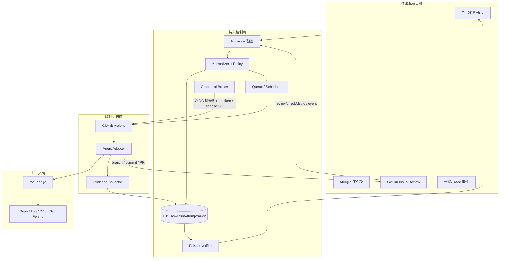
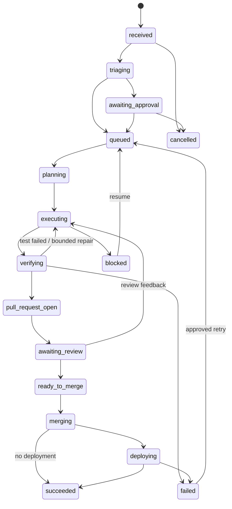

# Architecture

## 0. 结论与约束

方案可行，但必须接受三个平台事实：

1. 飞书 webhook 需要一个可公网访问且能验签、去重、快速响应的入口，不能直接“调用一个正在等待的 Action”。
2. GitHub-hosted Runner 的磁盘和进程是临时的，workflow 也有时长/并发/重跑边界，因此可恢复状态必须在 Runner 外持久化。
3. `repository_dispatch` / `workflow_dispatch` 载荷不是 Secret 通道；tool-bridge 凭证必须在运行时通过 OIDC 或受控 broker 换取。

因此系统分为持久控制面、临时执行面、上下文面和事实系统四部分。

## 1. 总体拓扑

默认部署选择是 Hono 控制面 + Cloudflare Worker、D1、Queues/Cron；这是默认宿主，不进入领域接口。将来可以替换为 Node + Postgres + 任意队列，Task/Run/Attempt 契约保持不变。

## 2. 模块边界

### M1. Ingress Adapters

- 接收飞书 challenge/event、Meegle webhook、GitHub App webhook、监控告警和人工 API。
- 在读取正文前完成平台验签、时间窗校验和事件 ID 去重。
- 3 秒内返回；耗时处理进入队列。
- 只做平台协议适配，不做 Agent 决策。

### M2. Normalizer + Policy Engine

- 把来源事件转换为 [Proto](Proto.md) 的 `TaskEnvelope v1`。
- 缺目标仓库、验收标准或授权时进入 `triaging` / `awaiting_approval`。
- 根据仓库策略计算允许的 tool-bridge scope、写权限、部署环境和审批要求。
- 策略由配置和人审决定，Agent 只能请求，不能修改。

### M3. Orchestrator

- 持有 Task、Run、Attempt 状态机和乐观并发版本。
- 使用 outbox 在“状态落库”和“派发 Action/发送飞书消息”之间保证最终一致。
- 同一 `target_repo + task_id` 默认只允许一个写 attempt；只读分诊可配置并行。
- 超时扫描器把失联 attempt 标为 `blocked` 或按策略重试，不直接宣告任务失败。

### M4. GitHub Dispatcher

- 使用 GitHub App installation token 向目标仓库触发固定版本的 reusable workflow。
- dispatch 只携带 `run_id`、`attempt_id`、`task_digest`、`callback_url` 等非敏感引用。
- 目标仓库必须显式安装 App、包含受信 workflow 或在中央 runner 白名单中；不对任意仓库执行。

### M5. Agent Runner + Adapter

- Runner bootstrap 校验任务 digest、检出指定 base SHA、创建 `agent/<task>/<attempt>` 分支。
- Adapter 统一 `start/resume/interrupt/exportCheckpoint`，底层可接 Codex、Claude Code 或其他 Agent。
- Agent 仅能通过封装命令调用工具；每种 effect（read/write/deploy/destructive）由外部 policy gate 判断。
- 每个步骤写 heartbeat、结构化 event 和 checkpoint；退出 trap 尽最大努力写终态，但控制面超时仍是最终兜底。

### M6. Credential Broker + tool-bridge

- Action 使用 GitHub OIDC JWT 证明 `repository/workflow/ref/run_id` 身份。
- Broker 校验 attempt 仍 active、仓库与 workflow 匹配后，签发短期 run token 和最小 scope 的 tool-bridge SK。
- 初始 MVP 可使用仓库级只读 Secret，但不得支持生产写入；OIDC broker 完成后才开放跨仓库写/部署。
- tool-bridge 访问被记录为类别化 trace（工具、资源路径、effect、结果），敏感参数按 schema 脱敏。

### M7. Evidence + Audit

- Evidence 是可验证结果：commit SHA、diff 摘要、测试命令及退出码、PR/check/deployment URL、审批记录。
- Audit 是不可覆盖的状态变化记录：actor、source event、from/to、reason、timestamp、payload digest。
- 原始 Agent session 可以单独加密存储并设置短保留期；结构化 checkpoint 和审计长期保存。

### M8. Feishu Experience

- 一个任务对应一张持续更新的卡片，显示状态、目标、证据和下一动作。
- 卡片动作只发意图事件；服务端重新鉴权，不能相信客户端隐藏按钮。
- 评论和补充材料创建新 revision；不会静默修改正在执行 attempt 的 prompt。

### M9. Merge + Deployment Gates

- 合并必须依赖目标仓库分支保护和 required checks。
- 测试部署、合并、生产部署是三个单独的状态/证据面。
- 生产环境使用 GitHub Environment reviewer 或外部审批，部署身份通过 OIDC 获取云权限。
- 部署失败默认保留 PR/commit 和诊断证据；自动回滚只调用仓库明确定义、可重跑的 rollback contract。

## 3. 核心状态模型

Run 是业务闭环，Attempt 是一次 Action 执行。一次 Run 可有多个 Attempt，但同一时刻最多一个具有仓库写租约。`failed` 可重试，不是不可恢复终态；`succeeded` 和 `cancelled` 才是不可继续的业务终态。

## 4. 持久化模型

| 表 | 关键字段 | 不变量 |
|---|---|---|
| `tasks` | source、task_key、revision、normalized body、target repo | `(source, tenant, task_key, revision)` 唯一 |
| `runs` | task_id、state、policy snapshot、version、active_attempt | 状态更新使用 compare-and-set |
| `attempts` | run_id、github run、base/head SHA、lease、heartbeat、result | 同一 run 单 active write lease |
| `checkpoints` | attempt_id、sequence、session ref、summary、next step、head SHA | sequence 单调递增，payload digest 固定 |
| `evidence` | kind、command、exit code、URL、artifact digest | append-only，不把日志文本等同成功 |
| `approvals` | action、actor、scope、decision、expires_at | 批准只作用于指定 revision/effect |
| `audit_events` | actor、from/to、reason、source event、digest | append-only |
| `outbox` | kind、destination、payload ref、delivery state | 与业务状态同事务写入 |

## 5. 端到端时序

### 5.1 新任务

1. Ingress 验签并以平台 event ID 去重。
2. Normalizer 生成 TaskEnvelope；控制面再以 source task revision 去重。
3. Policy 判断是否需澄清/审批，飞书卡片显示缺口。
4. 批准后创建 Run/Attempt/outbox，dispatcher 触发 Action。
5. Runner 通过 OIDC 换取 run token，获取完整任务和 tool-bridge scope。
6. Agent 规划、取证、修改、测试；每步上报 checkpoint/evidence。
7. 创建 Draft PR 后等待 checks/review；反馈触发新 attempt。
8. 满足闸门后合并/部署，控制面核对 GitHub deployment 结果后才置 `succeeded`。

### 5.2 恢复

1. 控制面发现 heartbeat 超时，撤销 attempt 的写租约和短期 token。
2. 新 attempt 检出 checkpoint 的 head SHA/分支并校验工作树。
3. Adapter 优先 resume provider session；不支持时注入结构化摘要、已读证据、未完成验收项和失败测试。
4. 新 attempt 只从 `nextStep` 继续；如果 Git 分支与 checkpoint digest 不一致，进入 `blocked` 等待人工裁决。

## 6. 并发、幂等与循环上限

- Event 去重键与 Task revision 去重键分开，解决“平台重放”和“用户真实修改”两个问题。
- 回调使用 `(attempt_id, sequence)` 幂等；乱序事件只追加审计，不回退状态。
- GitHub workflow 使用 `concurrency: delivery-${repo}-${task_id}`；控制面写租约是最终裁决，不能只依赖 Actions concurrency。
- 自动修复循环默认最多 3 个 attempt 或 2 次相同失败指纹；超过即 `blocked`。
- 合并前重新确认 base SHA/mergeability/required checks，避免长任务覆盖新提交。

## 7. 可观测性

每个来源事件、Task、Run、Attempt、GitHub run、PR 和 deployment 都携带关联 ID。关键指标包括 intake 延迟、排队延迟、attempt 成功率、恢复率、各状态停留时间、重复事件数、权限拒绝数和 Secret 扫描结果。日志按 `run_id/attempt_id` 查询，trace 不记录 Secret 或完整敏感数据行。

